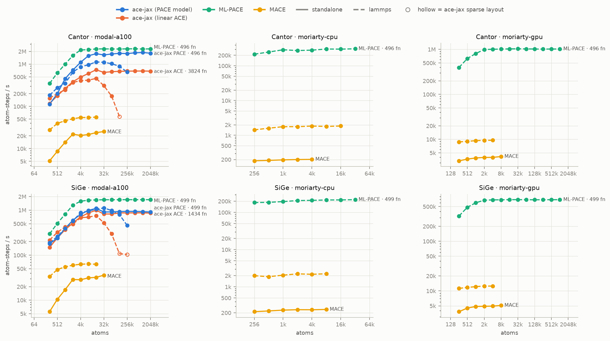
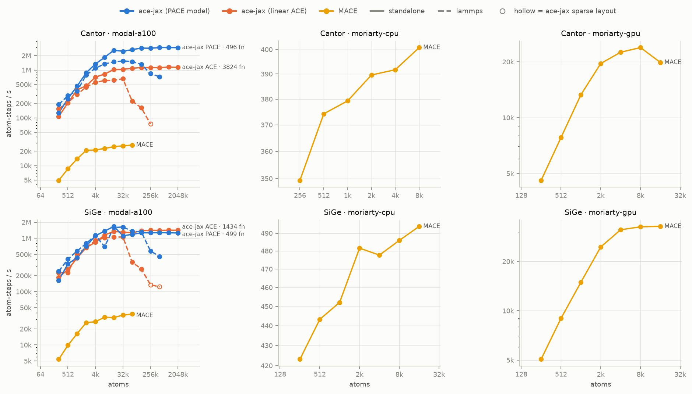
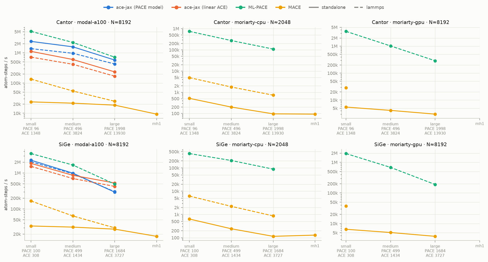
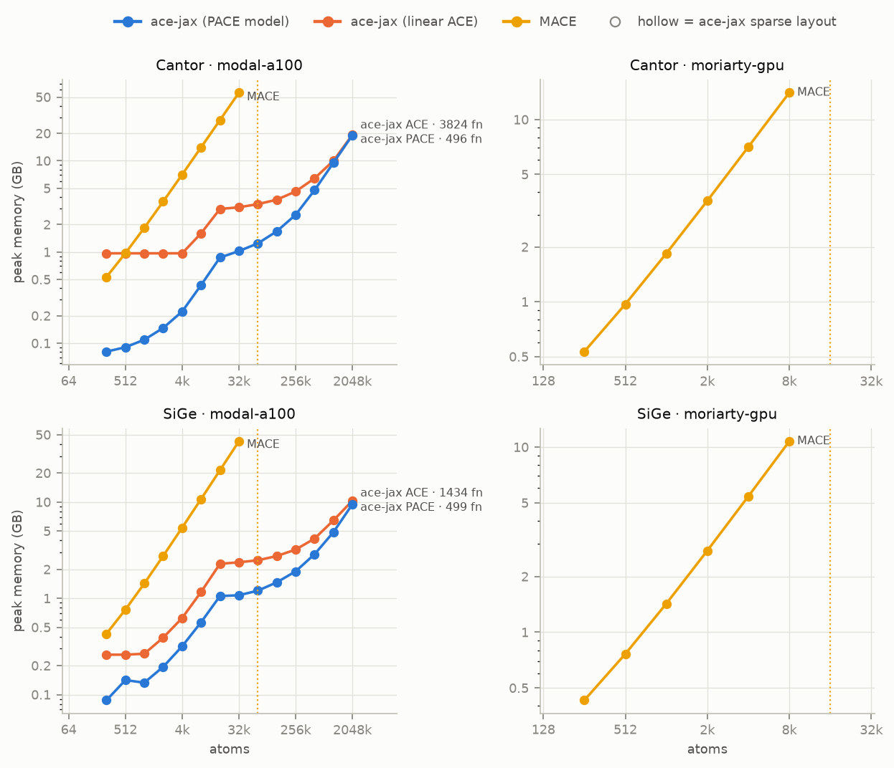
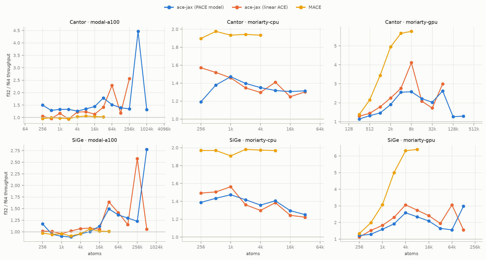
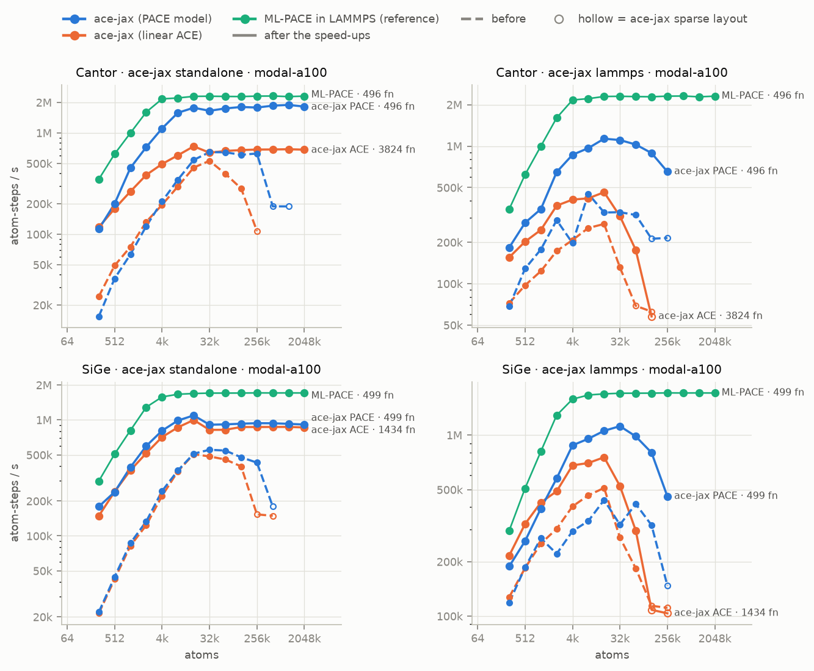

# Benchmarks

Throughput, model-size, memory and precision scaling for ace-jax, ML-PACE and MACE, standalone and in LAMMPS, on two systems, three model sizes, CPU and two GPUs.

This page is regenerated by `bench/scaling/plot.py` from the committed
results in `bench/scaling/results/*.jsonl`. This introduction lives in
`bench/scaling/benchmarks_intro.md`; everything below it is generated. The
design is in `docs/benchmark-scaling-spec.md`, and how to reproduce it is in
`bench/scaling/README.md`.

## What was measured

- **Codes:**
  - ace-jax evaluating PACE `.yace` files (`PACEModel`);
  - ace-jax evaluating linear ACE models (`ACEModel`);
  - ML-PACE, which runs the same `.yace` files;
  - MACE: MP-0b2 small, medium and large, plus MH-1 on its `omat_pbe` head.
- **Modes:**
  - **standalone** is one ASE calculator call (energy, forces and stress,
    neighbour list included), timed as the median of repeated calls;
  - **LAMMPS** is the MD step time.

  ace-jax runs in LAMMPS through lammps-jax (`pair_style jax/kk`), ML-PACE as
  `pace` / `pace/kk`, and MACE through Symmetrix.
- **Systems:** SiGe (a random alloy on diamond) and Cantor (a random
  equiatomic CrMnFeCoNi alloy on fcc).
- **Hosts:** moriarty CPU (16-core Xeon Silver 4216; LAMMPS with 16 MPI
  ranks, standalone on all 32 hardware threads); moriarty GPU (RTX A4500,
  20 GB); Modal A100-80GB.
- **Parity gate:** each host's parity checks passed before any timing ran:
  ace-jax against ML-PACE (gate `mlpace`), ace-jax standalone against
  ace-jax in LAMMPS in both bundle layouts (gate `acejax`), and MACE against
  Symmetrix (gate `mace`).

| host | gate | code | passed | max abs dE / atom (eV) | max abs dF (eV/Å) |
|---|---|---|---|---|---|
| modal-a100 | acejax | ace-jax (linear ACE) | 4/4 | 2.2e-16 | 2.0e-14 |
| modal-a100 | acejax | ace-jax (PACE model) | 4/4 | 2.8e-17 | 2.6e-15 |
| modal-a100 | mace | MACE | 2/2 | 6.9e-07 | 9.7e-05 |
| modal-a100 | mlpace | ML-PACE | 2/2 | 4.9e-14 | 4.1e-10 |
| moriarty-cpu | — | — | pending | | |
| moriarty-gpu | — | — | pending | | |

## Findings

The ace-jax rows were re-run after the speed-up branch
(`docs/perf-optimisation-results.md`); the rows from before it are kept in
`bench/scaling/results/before-perf/`, and the before/after figures below
compare the two. The tables are computed from the rows by
`bench/scaling/plot.py` on every render: medium models, at exactly 8,192
atoms on the GPUs and 2,048 on the CPU, as ranges over the two systems. A
host whose ace-jax rows are still being re-run shows "pending".

ML-PACE in LAMMPS against ace-jax PACE on the same `.yace` models (float64, atom-steps/s):

| host | N | ML-PACE in LAMMPS | ace-jax standalone | ace-jax in LAMMPS | ML-PACE ÷ ace-jax standalone | ML-PACE ÷ ace-jax in LAMMPS |
|---|---|---|---|---|---|---|
| modal-a100 | 8192 | 1.67M–2.22M | 989k–1.58M | 955k–968k | 1.4–1.7× | 1.7–2.3× |
| moriarty-cpu | 2048 | 208k–275k | pending | pending | pending | pending |
| moriarty-gpu | 8192 | 684k–1.02M | pending | pending | pending | pending |

ace-jax against MACE, same mode (float64 throughput ratio; where MACE ran out of memory at N, at the largest size both ran):

| host | mode | ace-jax PACE ÷ MACE | ace-jax ACE ÷ MACE |
|---|---|---|---|
| modal-a100 | standalone | 32–73× | 28× |
| modal-a100 | lammps | 15–18× | 7.7–11× |
| moriarty-cpu | standalone | pending | pending |
| moriarty-gpu | standalone | pending | pending |
| moriarty-gpu | lammps | pending | pending |

Largest system that ran standalone (float64, atoms), and the float32 / float64 throughput ratio at N:

| host | largest: ace-jax PACE | ace-jax ACE | MACE | f32 ÷ f64: ace-jax PACE | ace-jax ACE | MACE |
|---|---|---|---|---|---|---|
| modal-a100 | 2097152 | 2097152 | 32768 | 1.2–1.4× | 1.3–1.4× | 1.1× |
| moriarty-cpu | pending | pending | 4096–8192 | pending | pending | 1.9–2× |
| moriarty-gpu | pending | pending | 8192 | pending | pending | 5.8–6.4× |

- **ML-PACE in LAMMPS remains the fastest code on the A100,** and the gap to
  ace-jax on the same `.yace` models is much narrower than before the
  speed-ups. `docs/pace-performance-gap.md` traces the remaining gap.
- **ace-jax is faster than MACE, and fits far more atoms** in the same
  memory: on the A100 ace-jax now runs to the top of the size ladder
  standalone.
- **Standalone timing changed method with the speed-ups.** The ace-jax rows
  after them are MD-like (atoms moved slightly between calls, the neighbour
  list reused within its skin); the rows before, and the MACE rows, rebuild
  the neighbour list on every call.

## Caveats

- **The linear ACE models are larger than the PACE models they sit beside.**
  Plot labels and the "Model basis sizes" table give basis functions per
  central element. Linear ACE is 2–3× the PACE size on SiGe and 7–14× on
  Cantor, because the size ladder counted linear ACE functions as n_B / NZ,
  but every B function carries its own weight for each central element. So
  ACE-vs-PACE throughput differences mostly reflect basis size, not the code
  path. Matching the ladder is a follow-up.
- **Random weights.** The ace-jax and PACE models carry random coefficients
  where no fitted model exists. They are timing-only; their energies mean
  nothing physically.
- **MACE model revision.** MACE-MP-0b2 is used, not the original MP-0,
  because Symmetrix only exports models whose first interaction block is not
  residual.
  - MH-1 has the residual first block too, so it has no LAMMPS rows.
  - Symmetrix evaluates in double whatever precision it's given, so MACE
    LAMMPS rows are float64 only.
- **ace-jax in LAMMPS is GPU-only.** lammps-jax provides only `jax/kk`.
- **Neighbour list.** Standalone ace-jax numbers use `matscipy-neighbours`
  (the `fast-neighbours` extra, built with CUDA on the GPU hosts, so the
  dense neighbour graph is built on the device). A default install falls
  back to ASE's neighbour list and is slower end to end.
- **LAMMPS step counts.** Each case times about 60 s of MD (10–200 steps,
  sized from the previous size's step time) after 3–50 warm-up steps. This
  is a deviation from the spec's fixed 200/50, made so the slow MACE CPU
  cases finish.
- **Out-of-memory markers.** On the CPU host, cases are killed at 48 GB of
  resident memory (the node has 62 GB); on GPUs they stop at the device
  limit. A dotted vertical line marks the first size that did not fit.
- **Follow-ups:** ACEpotentials.jl rows (direct evaluation, and the `--trim`
  LAMMPS export) and the production ace-jax model (linear + species +
  density embedding) will be added later.

## Figures

Hollow markers: ace-jax chose the sparse layout.

Before/after figures pending (ace-jax rows being re-run): moriarty-cpu, moriarty-gpu.

*Throughput vs system size (float64, medium models): solid = standalone, dashed = LAMMPS. “fn”: basis functions per central element (linear ACE is 2–14× the PACE size).*

*The same in float32. ML-PACE and Symmetrix (MACE in LAMMPS) evaluate in double, so they are absent.*

*Throughput vs model size at exactly 8,192 atoms on GPU and 2,048 on CPU; a line is absent at a size that did not fit. Ticks give basis functions per central element.*

*Peak device memory vs system size (standalone); dotted verticals mark the first size that did not fit.*

*float32 / float64 throughput ratio (standalone).*

*ace-jax throughput before (dashed) and after (solid) the speed-ups, float64, medium models; ML-PACE in LAMMPS for reference. Before rows: `bench/scaling/results/before-perf/`. “fn”: basis functions per central element.*

## Model basis sizes

| system | size | PACE | linear ACE | ACE / PACE |
|---|---|--:|--:|--:|
| Cantor | small | 96 | 1348 | 14.0× |
| Cantor | medium | 496 | 3824 | 7.7× |
| Cantor | large | 1998 | 13930 | 7.0× |
| SiGe | small | 100 | 308 | 3.1× |
| SiGe | medium | 499 | 1434 | 2.9× |
| SiGe | large | 1684 | 3727 | 2.2× |

## Largest system that fits (medium, float64)

| host | system | code | mode | largest that ran | first out of memory |
|---|---|---|---|---|---|
| modal-a100 | Cantor | ace-jax (linear ACE) | lammps | 131072 | 262144 |
| modal-a100 | Cantor | ace-jax (linear ACE) | standalone | 2097152 | — |
| modal-a100 | Cantor | ace-jax (PACE model) | lammps | 262144 | 524288 |
| modal-a100 | Cantor | ace-jax (PACE model) | standalone | 2097152 | — |
| modal-a100 | Cantor | MACE | lammps | 16384 | 32768 |
| modal-a100 | Cantor | MACE | standalone | 32768 | 65536 |
| modal-a100 | Cantor | ML-PACE | lammps | 2097152 | — |
| modal-a100 | SiGe | ace-jax (linear ACE) | lammps | 262144 | 524288 |
| modal-a100 | SiGe | ace-jax (linear ACE) | standalone | 2097152 | — |
| modal-a100 | SiGe | ace-jax (PACE model) | lammps | 262144 | 524288 |
| modal-a100 | SiGe | ace-jax (PACE model) | standalone | 2097152 | — |
| modal-a100 | SiGe | MACE | lammps | 16384 | 32768 |
| modal-a100 | SiGe | MACE | standalone | 32768 | 65536 |
| modal-a100 | SiGe | ML-PACE | lammps | 2097152 | — |
| moriarty-cpu | Cantor | MACE | lammps | 16384 | 32768 |
| moriarty-cpu | Cantor | MACE | standalone | 4096 | 8192 |
| moriarty-cpu | Cantor | ML-PACE | lammps | 32768 | — |
| moriarty-cpu | SiGe | MACE | lammps | 8192 | 16384 |
| moriarty-cpu | SiGe | MACE | standalone | 8192 | 16384 |
| moriarty-cpu | SiGe | ML-PACE | lammps | 32768 | — |
| moriarty-gpu | Cantor | MACE | lammps | 4096 | 8192 |
| moriarty-gpu | Cantor | MACE | standalone | 8192 | 16384 |
| moriarty-gpu | Cantor | ML-PACE | lammps | 1048576 | — |
| moriarty-gpu | SiGe | MACE | lammps | 4096 | 8192 |
| moriarty-gpu | SiGe | MACE | standalone | 8192 | 16384 |
| moriarty-gpu | SiGe | ML-PACE | lammps | 1048576 | — |

## Tables

| host | system | code | mode | size | dtype | atoms | atom-steps/s |
|---|---|---|---|---|---|---|---|
| modal-a100 | Cantor | ace-jax (linear ACE) | lammps | large | float64 | 8192 | 1.68e+05 |
| modal-a100 | SiGe | ace-jax (linear ACE) | lammps | large | float64 | 8192 | 4.23e+05 |
| modal-a100 | Cantor | ace-jax (linear ACE) | lammps | medium | float64 | 8192 | 4.18e+05 |
| modal-a100 | SiGe | ace-jax (linear ACE) | lammps | medium | float64 | 8192 | 7.02e+05 |
| modal-a100 | Cantor | ace-jax (linear ACE) | lammps | small | float64 | 8192 | 7.22e+05 |
| modal-a100 | SiGe | ace-jax (linear ACE) | lammps | small | float64 | 8192 | 1.53e+06 |
| modal-a100 | Cantor | ace-jax (linear ACE) | standalone | large | float64 | 8192 | 2.34e+05 |
| modal-a100 | SiGe | ace-jax (linear ACE) | standalone | large | float64 | 8192 | 5.26e+05 |
| modal-a100 | Cantor | ace-jax (linear ACE) | standalone | medium | float64 | 8192 | 6.02e+05 |
| modal-a100 | SiGe | ace-jax (linear ACE) | standalone | medium | float64 | 8192 | 8.64e+05 |
| modal-a100 | Cantor | ace-jax (linear ACE) | standalone | small | float64 | 8192 | 1.12e+06 |
| modal-a100 | SiGe | ace-jax (linear ACE) | standalone | small | float64 | 8192 | 1.85e+06 |
| modal-a100 | Cantor | ace-jax (PACE model) | lammps | large | float64 | 8192 | 4.27e+05 |
| modal-a100 | SiGe | ace-jax (PACE model) | lammps | large | float64 | 8192 | 3.01e+05 |
| modal-a100 | Cantor | ace-jax (PACE model) | lammps | medium | float64 | 8192 | 9.68e+05 |
| modal-a100 | SiGe | ace-jax (PACE model) | lammps | medium | float64 | 8192 | 9.55e+05 |
| modal-a100 | Cantor | ace-jax (PACE model) | lammps | small | float64 | 8192 | 1.38e+06 |
| modal-a100 | SiGe | ace-jax (PACE model) | lammps | small | float64 | 8192 | 2.05e+06 |
| modal-a100 | Cantor | ace-jax (PACE model) | standalone | large | float64 | 8192 | 5.77e+05 |
| modal-a100 | SiGe | ace-jax (PACE model) | standalone | large | float64 | 8192 | 2.93e+05 |
| modal-a100 | Cantor | ace-jax (PACE model) | standalone | medium | float64 | 8192 | 1.58e+06 |
| modal-a100 | SiGe | ace-jax (PACE model) | standalone | medium | float64 | 8192 | 9.89e+05 |
| modal-a100 | Cantor | ace-jax (PACE model) | standalone | small | float64 | 8192 | 2.39e+06 |
| modal-a100 | SiGe | ace-jax (PACE model) | standalone | small | float64 | 8192 | 2.27e+06 |
| modal-a100 | Cantor | MACE | lammps | large | float64 | 8192 | 2.49e+04 |
| modal-a100 | SiGe | MACE | lammps | large | float64 | 8192 | 2.97e+04 |
| modal-a100 | Cantor | MACE | lammps | medium | float64 | 8192 | 5.45e+04 |
| modal-a100 | SiGe | MACE | lammps | medium | float64 | 8192 | 6.39e+04 |
| modal-a100 | Cantor | MACE | lammps | small | float64 | 8192 | 1.35e+05 |
| modal-a100 | SiGe | MACE | lammps | small | float64 | 8192 | 1.67e+05 |
| modal-a100 | Cantor | MACE | standalone | large | float64 | 8192 | 1.85e+04 |
| modal-a100 | SiGe | MACE | standalone | large | float64 | 8192 | 2.74e+04 |
| modal-a100 | Cantor | MACE | standalone | medium | float64 | 8192 | 2.16e+04 |
| modal-a100 | SiGe | MACE | standalone | medium | float64 | 8192 | 3.12e+04 |
| modal-a100 | Cantor | MACE | standalone | mh1 | float64 | 8192 | 9.35e+03 |
| modal-a100 | SiGe | MACE | standalone | mh1 | float64 | 8192 | 1.73e+04 |
| modal-a100 | Cantor | MACE | standalone | small | float64 | 8192 | 2.38e+04 |
| modal-a100 | SiGe | MACE | standalone | small | float64 | 8192 | 3.35e+04 |
| modal-a100 | Cantor | ML-PACE | lammps | large | float64 | 8192 | 7.17e+05 |
| modal-a100 | SiGe | ML-PACE | lammps | large | float64 | 8192 | 4.89e+05 |
| modal-a100 | Cantor | ML-PACE | lammps | medium | float64 | 8192 | 2.22e+06 |
| modal-a100 | SiGe | ML-PACE | lammps | medium | float64 | 8192 | 1.67e+06 |
| modal-a100 | Cantor | ML-PACE | lammps | small | float64 | 8192 | 5.14e+06 |
| modal-a100 | SiGe | ML-PACE | lammps | small | float64 | 8192 | 3.47e+06 |
| moriarty-cpu | Cantor | MACE | lammps | large | float64 | 2048 | 731 |
| moriarty-cpu | SiGe | MACE | lammps | large | float64 | 2048 | 866 |
| moriarty-cpu | Cantor | MACE | lammps | medium | float64 | 2048 | 1.77e+03 |
| moriarty-cpu | SiGe | MACE | lammps | medium | float64 | 2048 | 2.23e+03 |
| moriarty-cpu | Cantor | MACE | lammps | small | float64 | 2048 | 4.91e+03 |
| moriarty-cpu | SiGe | MACE | lammps | small | float64 | 2048 | 6.18e+03 |
| moriarty-cpu | Cantor | MACE | standalone | large | float64 | 2048 | 96.1 |
| moriarty-cpu | SiGe | MACE | standalone | large | float64 | 2048 | 115 |
| moriarty-cpu | Cantor | MACE | standalone | medium | float64 | 2048 | 201 |
| moriarty-cpu | SiGe | MACE | standalone | medium | float64 | 2048 | 243 |
| moriarty-cpu | Cantor | MACE | standalone | mh1 | float64 | 2048 | 93.2 |
| moriarty-cpu | SiGe | MACE | standalone | mh1 | float64 | 2048 | 130 |
| moriarty-cpu | Cantor | MACE | standalone | small | float64 | 2048 | 517 |
| moriarty-cpu | SiGe | MACE | standalone | small | float64 | 2048 | 637 |
| moriarty-cpu | Cantor | ML-PACE | lammps | large | float64 | 2048 | 1.09e+05 |
| moriarty-cpu | SiGe | ML-PACE | lammps | large | float64 | 2048 | 8.85e+04 |
| moriarty-cpu | Cantor | ML-PACE | lammps | medium | float64 | 2048 | 2.75e+05 |
| moriarty-cpu | SiGe | ML-PACE | lammps | medium | float64 | 2048 | 2.08e+05 |
| moriarty-cpu | Cantor | ML-PACE | lammps | small | float64 | 2048 | 7.45e+05 |
| moriarty-cpu | SiGe | ML-PACE | lammps | small | float64 | 2048 | 4.13e+05 |
| moriarty-gpu | Cantor | MACE | lammps | large | float64 | 2048 | 4.09e+03 |
| moriarty-gpu | SiGe | MACE | lammps | large | float64 | 2048 | 5.48e+03 |
| moriarty-gpu | Cantor | MACE | lammps | medium | float64 | 4096 | 9.54e+03 |
| moriarty-gpu | SiGe | MACE | lammps | medium | float64 | 4096 | 1.25e+04 |
| moriarty-gpu | Cantor | MACE | lammps | small | float64 | 8192 | 2.86e+04 |
| moriarty-gpu | SiGe | MACE | lammps | small | float64 | 8192 | 3.71e+04 |
| moriarty-gpu | Cantor | MACE | standalone | large | float64 | 8192 | 3.01e+03 |
| moriarty-gpu | SiGe | MACE | standalone | large | float64 | 8192 | 3.81e+03 |
| moriarty-gpu | Cantor | MACE | standalone | medium | float64 | 8192 | 4.14e+03 |
| moriarty-gpu | SiGe | MACE | standalone | medium | float64 | 8192 | 5.08e+03 |
| moriarty-gpu | Cantor | MACE | standalone | mh1 | float64 | 2048 | 1.21e+03 |
| moriarty-gpu | SiGe | MACE | standalone | mh1 | float64 | 4096 | 2.06e+03 |
| moriarty-gpu | Cantor | MACE | standalone | small | float64 | 8192 | 5.5e+03 |
| moriarty-gpu | SiGe | MACE | standalone | small | float64 | 8192 | 6.49e+03 |
| moriarty-gpu | Cantor | ML-PACE | lammps | large | float64 | 8192 | 2.88e+05 |
| moriarty-gpu | SiGe | ML-PACE | lammps | large | float64 | 8192 | 1.89e+05 |
| moriarty-gpu | Cantor | ML-PACE | lammps | medium | float64 | 8192 | 1.02e+06 |
| moriarty-gpu | SiGe | ML-PACE | lammps | medium | float64 | 8192 | 6.84e+05 |
| moriarty-gpu | Cantor | ML-PACE | lammps | small | float64 | 8192 | 3.54e+06 |
| moriarty-gpu | SiGe | ML-PACE | lammps | small | float64 | 8192 | 1.94e+06 |

| host | code | mode | median compile / export (s) |
|---|---|---|---|
| modal-a100 | ace-jax (linear ACE) | lammps | 0.9 |
| modal-a100 | ace-jax (linear ACE) | standalone | 6.7 |
| modal-a100 | ace-jax (PACE model) | lammps | 1.4 |
| modal-a100 | ace-jax (PACE model) | standalone | 9.0 |
| modal-a100 | MACE | standalone | 9.8 |
| moriarty-cpu | MACE | standalone | 5.6 |
| moriarty-gpu | MACE | standalone | 12.5 |

## Versions

- **modal-a100**: ase 3.29.0, jax 0.11.2, jaxlib 0.11.2, mace-torch 0.3.16, matscipy 1.2.0, matscipy-neighbours 1.0.0, python 3.12.1, torch 2.14.0
- **moriarty-cpu**: ace-jax 0.1.0, ase 3.29.0, jax 0.11.2, jaxlib 0.11.2, mace-torch 0.3.16, matscipy 1.2.0, matscipy-neighbours 0.1.0, python 3.12.8, torch 2.14.0
- **moriarty-gpu**: ace-jax 0.1.0, ase 3.29.0, jax 0.11.2, jaxlib 0.11.2, mace-torch 0.3.16, matscipy 1.2.0, matscipy-neighbours 0.1.0, python 3.12.8, torch 2.14.0
