# Benchmarks

Throughput, model-size, memory and precision scaling for ace-jax, ML-PACE and MACE, standalone and in LAMMPS, on two systems, three model sizes, CPU and two GPUs.

This page is regenerated by `bench/scaling/plot.py` from the committed
results in `bench/scaling/results/*.jsonl`. This introduction lives in
`bench/scaling/benchmarks_intro.md`; everything below it is generated. The
design is in `docs/dev/benchmark-scaling-spec.md`, and how to reproduce it is in
`bench/scaling/README.md`.

## What was measured

- **Codes:**
  - ace-jax evaluating PACE `.yace` files (`PACEModel`);
  - ace-jax evaluating linear ACE models (`ACEModel`);
  - ML-PACE, which runs the same `.yace` files;
  - MACE: MP-0b2 small, medium and large, plus MH-1 on its `omat_pbe` head;
  - ace-jax on learned-radial proxies of the medium linear ACE models,
    splined as deployed and kept analytic (below);
  - ACEpotentials.jl on the same linear ACE models, CPU only: direct
    evaluation (`acepotentials`), and the model compiled by ACEpotentials.jl
    PR 309's `juliac --trim` export and run in LAMMPS (`acepotentials-trim`;
    below).
- **Modes:**
  - **standalone** is one ASE calculator call (energy, forces and stress,
    neighbour list included), timed as the median of repeated calls;
  - **LAMMPS** is the MD step time.

  ace-jax runs in LAMMPS through lammps-jax (`pair_style jax/kk`), ML-PACE as
  `pace` / `pace/kk`, MACE through Symmetrix, and the ACEpotentials.jl trim
  library through the PR's `pair_style ace` plugin (MPI ranks, as ML-PACE).
- **Systems:** SiGe (a random alloy on diamond) and Cantor (a random
  equiatomic CrMnFeCoNi alloy on fcc).
- **Hosts:** moriarty CPU (16-core Xeon Silver 4216; LAMMPS with 16 MPI
  ranks, standalone on all 32 hardware threads); moriarty GPU (RTX A4500,
  20 GB); Modal A100-80GB; lestrade CPU (`lestrade-cpu`: an i9-14900K, on its
  8 P-cores only, CPUs 0-15; LAMMPS with 8 MPI ranks bound one per P-core,
  standalone on the 16 P-core hardware threads), the one CPU host that runs
  the ACEpotentials.jl lines next to ace-jax, ML-PACE and MACE.
- **Parity gate:** each host's parity checks passed before any timing ran:
  ace-jax against ML-PACE (gate `mlpace`), ace-jax standalone against
  ace-jax in LAMMPS in both bundle layouts (gate `acejax`), and MACE against
  Symmetrix (gate `mace`). The learned-radial lines are gated on the medium
  models: standalone against LAMMPS (gate `acejax`), and splined against
  analytic (gate `spline`: |dE|/|E| <= 1e-9, max|dF| / max|F| <= 3e-8, the
  splining accuracy at 1e-10 rather than roundoff). The ACEpotentials.jl
  lines are gated on the small models (CPU hosts): direct ACEpotentials.jl
  against ace-jax on the npz (gate `acepot`, |dE|/atom <= 1e-10, |dF| <= 1e-9),
  the trim library in LAMMPS against Julia's ETACE evaluation of the exact
  model it compiles (gate `trim`, the same thresholds), and the trim library
  against ace-jax (gate `trim-ace`, |dF| <= 1e-3: the spline error, below).

| host | gate | code | passed | max abs dE / atom (eV) | max abs dF (eV/Å) |
|---|---|---|---|---|---|
| lestrade-cpu | acepot | ACEpotentials.jl (linear ACE, direct) | 2/2 | 2.2e-16 | 1.8e-14 |
| lestrade-cpu | mace | MACE | 2/2 | 6.9e-07 | 9.7e-05 |
| lestrade-cpu | mlpace | ML-PACE | 2/2 | 4.8e-14 | 4.1e-10 |
| lestrade-cpu | spline | ace-jax (linear ACE, learned radial, splined) | 2/2 | 2.1e-12 | 3.1e-08 |
| lestrade-cpu | trim | ACEpotentials.jl (linear ACE, trim library in LAMMPS) | 2/2 | 5.6e-17 | 4.4e-15 |
| lestrade-cpu | trim-ace | ACEpotentials.jl (linear ACE, trim library in LAMMPS) | 2/2 | 3.0e-08 | 1.9e-06 |
| modal-a100 | acejax | ace-jax (linear ACE) | 8/8 | 2.7e-15 | 2.5e-14 |
| modal-a100 | acejax | ace-jax (linear ACE, learned radial, analytic) | 6/6 | 1.7e-16 | 2.0e-14 |
| modal-a100 | acejax | ace-jax (linear ACE, learned radial, splined) | 6/6 | 2.2e-16 | 7.5e-13 |
| modal-a100 | acejax | ace-jax (PACE model) | 8/8 | 8.3e-17 | 2.7e-15 |
| modal-a100 | mace | MACE | 2/2 | 6.9e-07 | 9.7e-05 |
| modal-a100 | mlpace | ML-PACE | 2/2 | 4.9e-14 | 4.1e-10 |
| modal-a100 | spline | ace-jax (linear ACE, learned radial, splined) | 2/2 | 2.1e-12 | 3.1e-08 |
| moriarty-cpu | mace | MACE | 2/2 | 6.9e-07 | 9.7e-05 |
| moriarty-cpu | mlpace | ML-PACE | 2/2 | 4.8e-14 | 4.1e-10 |
| moriarty-cpu | spline | ace-jax (linear ACE, learned radial, splined) | 2/2 | 2.1e-12 | 3.1e-08 |
| moriarty-gpu | acejax | ace-jax (linear ACE) | 6/6 | 3.9e-16 | 2.4e-14 |
| moriarty-gpu | acejax | ace-jax (linear ACE, learned radial, analytic) | 6/6 | 1.1e-16 | 2.0e-14 |
| moriarty-gpu | acejax | ace-jax (linear ACE, learned radial, splined) | 6/6 | 5.6e-17 | 1.2e-12 |
| moriarty-gpu | acejax | ace-jax (PACE model) | 6/6 | 5.6e-17 | 2.7e-15 |
| moriarty-gpu | mace | MACE | 2/2 | 6.9e-07 | 9.7e-05 |
| moriarty-gpu | mlpace | ML-PACE | 2/2 | 4.9e-14 | 4.1e-10 |
| moriarty-gpu | spline | ace-jax (linear ACE, learned radial, splined) | 2/2 | 2.1e-12 | 3.1e-08 |

**Learned radials.** A learned radial (`fit/radial_learn.py`) lives on the
analytic branch, a per-edge polynomial recursion that costs more than the
stock models' spline gather and loses the species-compact lean form;
`lean`'s default (`spline_tol="auto"`) splines it back at 1e-10. The
`acejax-ace-learned` (splined, as deployed) and `acejax-ace-analytic`
(`spline_tol=None`, exact) lines measure both, beside the stock linear ACE
line. They are learned-radial *proxies*, not fitted radials: the medium ACE
models projected onto n_q = 12 polynomials (`to_analytic`), with the active
rows of the radial weights perturbed by 10% (seed 0) to mimic learning while
keeping the per-species zero pattern that learning preserves
(`models.py ace-learned`). Medium models only. The method and the
same-container measurements are in `docs/dev/learned-radial-splining.md`.

**ACEpotentials.jl.** Both lines run the linear ACE models the ace-jax
`acejax-ace` line runs, rebuilt in a pinned Julia 1.12 env
(`bench/scaling/julia/`, ACEpotentials.jl v0.10.2): every run rebuilds the
`ace1_model` with the seed the `.npz` was built with and checks it identical
to the `.npz` (bases, A2B map, spline tables, weights, and energy, forces and
virial on the `.npz`'s test structure), failing rather than timing another
model. Everything is compared exactly except the A2B map, which is compared
to roundoff: its coupling coefficients differ at the ULP level between Julia
1.11, which wrote the `.npz` files, and the 1.12 env (SiGe large: 72 entries,
at most 8.3e-16 relative). `acepotentials` times `AtomsCalculators.energy_forces_virial` (neighbour
list included) on the same displaced structures as the other standalone
lines, after a warm-up call, and records each call's garbage-collection
share. `acepotentials-trim` exports the model's *exact twin* (the same basis
and weights with the polynomial radials `ace1_model` tabulates, instead of its
splines) to a `--trim=safe` shared library, run by LAMMPS in float64 on the
CPU. **The two lines therefore differ by the spline error:** ace-jax and
direct ACEpotentials.jl evaluate the `.npz`'s spline tables, the trim library
the exact radials, which differ by 2.8e-6 to 5.5e-4 eV/Å in force on these
random-weight models (rattled 256-atom structures, the PR 309 spike). The
`trim-ace` gate checks that bound; the `trim` gate
checks the library against the exact model to round-off.

## Findings

The ace-jax rows were re-run after the speed-up branch
(`docs/dev/perf-optimisation-results.md`); the rows from before it are kept in
`bench/scaling/results/before-perf/`, and the before/after figures below
compare the two. The tables are computed from the rows by
`bench/scaling/plot.py` on every render: medium models, at exactly 8,192
atoms on the GPUs and 2,048 on the CPU, as ranges over the two systems.

ML-PACE in LAMMPS against ace-jax PACE on the same `.yace` models (float64, atom-steps/s):

| host | N | ML-PACE in LAMMPS | ace-jax standalone | ace-jax in LAMMPS | ML-PACE ÷ ace-jax standalone | ML-PACE ÷ ace-jax in LAMMPS |
|---|---|---|---|---|---|---|
| lestrade-cpu | 2048 | 417k–562k | 25k–40k | — | 14–17× | — |
| modal-a100 | 8192 | 1.67M–2.22M | 714k–1.26M | 1.14M–1.40M | 1.8–2.3× | 1.5–1.6× |
| moriarty-cpu | 2048 | 208k–275k | 16k–23k | — | 12–13× | — |
| moriarty-gpu | 8192 | 684k–1.02M | 251k–416k | 209k–271k | 2.4–2.7× | 3.3–3.8× |

ace-jax against MACE, same mode (float64 throughput ratio; where MACE ran out of memory at N, at the largest size both ran):

| host | mode | ace-jax PACE ÷ MACE | ace-jax ACE ÷ MACE |
|---|---|---|---|
| lestrade-cpu | standalone | 76–1.5e+02× | 1.1e+02–2e+02× |
| modal-a100 | standalone | 23–59× | 48–73× |
| modal-a100 | lammps | 18–26× | 16–36× |
| moriarty-cpu | standalone | 65–1.1e+02× | 92–1.5e+02× |
| moriarty-gpu | standalone | 49–1e+02× | 1.3e+02–1.4e+02× |
| moriarty-gpu | lammps | 17–29× (at 4096) | 32–48× (at 4096) |

Largest system that ran standalone (float64, atoms), and the float32 / float64 throughput ratio at N:

| host | largest: ace-jax PACE | ace-jax ACE | MACE | f32 ÷ f64: ace-jax PACE | ace-jax ACE | MACE |
|---|---|---|---|---|---|---|
| lestrade-cpu | 32768 | 32768 | 4096–8192 | 1.9–2× | 1.6–1.7× | 2–2.1× |
| modal-a100 | 2097152 | 2097152 | 32768 | 1.2–1.4× | 1.2–1.4× | 1.1× |
| moriarty-cpu | 32768 | 32768 | 4096–8192 | 1.6–1.7× | 1.4× | 1.9–2× |
| moriarty-gpu | 1048576 | 1048576 | 8192 | 3.5–3.8× | 2.7–3.4× | 5.8–6.4× |

- **ML-PACE in LAMMPS remains the fastest code on the A100,** and the gap to
  ace-jax on the same `.yace` models is much narrower than before the
  speed-ups. `docs/dev/pace-performance-gap.md` traces the remaining gap.
- **ace-jax is faster than MACE, and fits far more atoms** in the same
  memory: on the A100 ace-jax now runs to the top of the size ladder
  standalone.
- **Standalone timing changed method with the speed-ups.** The ace-jax rows
  after them are MD-like (atoms moved slightly between calls, the neighbour
  list reused within its skin); the rows before, and the MACE rows, rebuild
  the neighbour list on every call.

## Caveats

- **The linear ACE models are larger than the PACE models they sit beside.**
  Plot labels and the "Model basis sizes" table give basis functions per
  central element. Linear ACE is 2–3× the PACE size on SiGe and 7–14× on
  Cantor, because the size ladder counted linear ACE functions as n_B / NZ,
  but every B function carries its own weight for each central element. So
  ACE-vs-PACE throughput differences mostly reflect basis size, not the code
  path. Matching the ladder is a follow-up.
- **Modal A100 rows vary about 20–25% between containers,** even on the same
  card type (A100-SXM4); the same-container A/B in
  `bench/perf/results/microbench_*_fcf6f8e_ab.json` shows it. Where a case was
  run more than once (Modal: separate containers), the point is the median
  and the bar spans min–max. The controlled before/after comparisons are the
  same-container micro-benchmarks in `docs/dev/perf-optimisation-results.md`.
- **Random weights.** The ace-jax and PACE models carry random coefficients
  where no fitted model exists. They are timing-only; their energies mean
  nothing physically.
- **MACE model revision.** MACE-MP-0b2 is used, not the original MP-0,
  because Symmetrix only exports models whose first interaction block is not
  residual.
  - MH-1 has the residual first block too, so it has no LAMMPS rows.
  - Symmetrix evaluates in double whatever precision it's given, so MACE
    LAMMPS rows are float64 only.
- **ace-jax in LAMMPS is GPU-only.** lammps-jax provides only `jax/kk`.
- **Neighbour list.** Standalone ace-jax numbers use `matscipy-neighbours`
  (the `fast-neighbours` extra, built with CUDA on the GPU hosts, so the
  dense neighbour graph is built on the device). A default install falls
  back to ASE's neighbour list and is slower end to end.
- **LAMMPS step counts.** Each case times about 60 s of MD (10–200 steps,
  sized from the previous size's step time) after 3–50 warm-up steps. This
  is a deviation from the spec's fixed 200/50, made so the slow MACE CPU
  cases finish.
- **lestrade has its own Symmetrix tree.** moriarty's build is compiled for
  its AVX-512 CPU and dies with an illegal instruction on the i9-14900K, so
  lestrade's MACE LAMMPS rows use a CPU-only build of the same pinned sources
  (lammps patch_10Sep2025 + Symmetrix 0d86e1e, no Kokkos, ML-PACE on, libsymmetrix
  at `-march=native` = AVX2) via `lmp-cpu.sh`. lestrade's ML-PACE rows were
  recorded earlier with moriarty's binary (ML-PACE runs fine there).
- **Out-of-memory markers.** On the CPU hosts, cases are killed at 48 GB of
  resident memory (the node has 62 GB); on GPUs they stop at the device
  limit. A dotted vertical line marks the first size that did not fit.
- **ACEpotentials.jl lines are CPU only,** float64, and their trim libraries
  are compiled for the CPU they are built on (`models.py acepotentials-trim`
  rebuilds on another CPU model); the `.so` links the Julia runtime of the
  build machine by absolute path.
- **Follow-up:** the production ace-jax model (linear + species + density
  embedding) will be added later.

## Figures

Hollow markers: ace-jax chose the sparse layout. Where a case was run more than once (Modal: separate containers), the point is the median and the bar spans min–max.

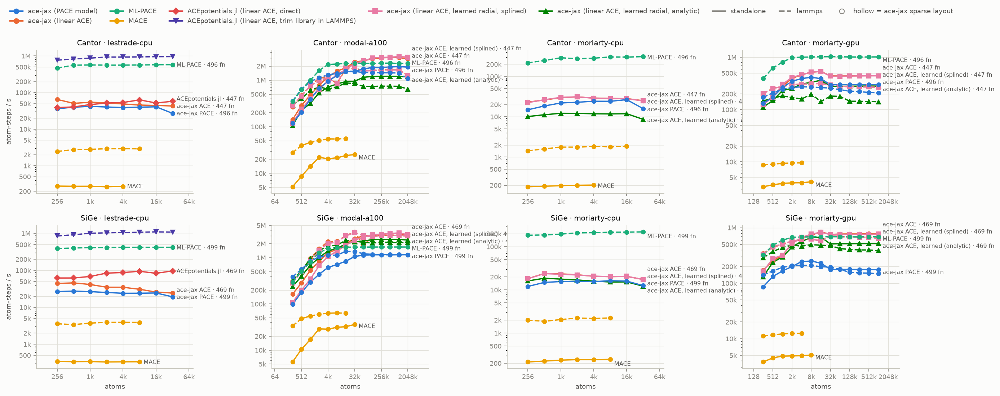

*Throughput vs system size (float64, medium models): solid = standalone, dashed = LAMMPS. “fn”: basis functions per central element (linear ACE is 2–14× the PACE size). The ACEpotentials.jl lines (CPU only) evaluate the linear ACE model: direct (splined, as ace-jax) and its trim library (exact radials, a spline error apart).*

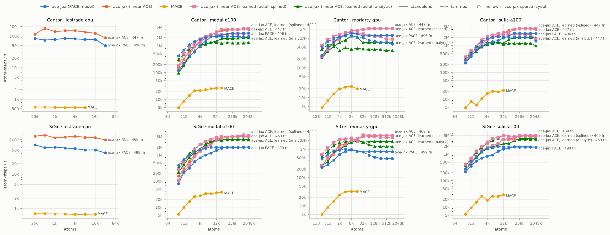

*The same in float32. ML-PACE and Symmetrix (MACE in LAMMPS) evaluate in double, so they are absent.*

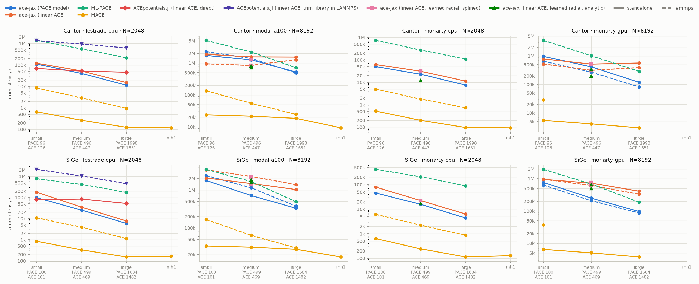

*Throughput vs model size at exactly 8,192 atoms on GPU and 2,048 on CPU; a line is absent at a size that did not fit. Ticks give basis functions per central element.*

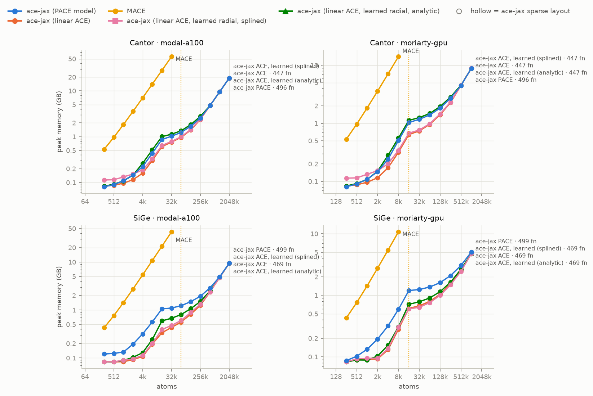

*Peak device memory vs system size (standalone); dotted verticals mark the first size that did not fit.*

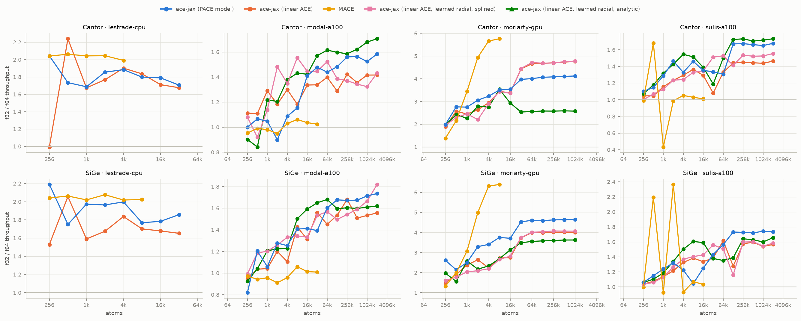

*float32 / float64 throughput ratio (standalone).*

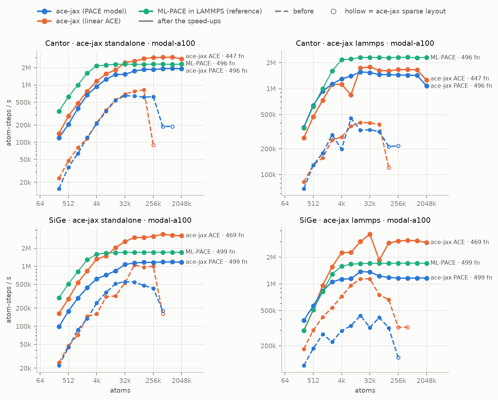

*ace-jax throughput before (dashed) and after (solid) the speed-ups, float64, medium models; ML-PACE in LAMMPS for reference. Before rows: `bench/scaling/results/before-perf/`. “fn”: basis functions per central element.*

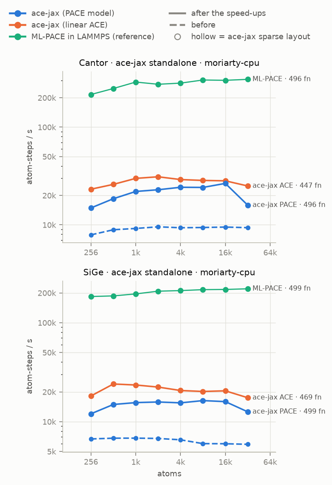

*ace-jax throughput before (dashed) and after (solid) the speed-ups, float64, medium models; ML-PACE in LAMMPS for reference. Before rows: `bench/scaling/results/before-perf/`. “fn”: basis functions per central element.*

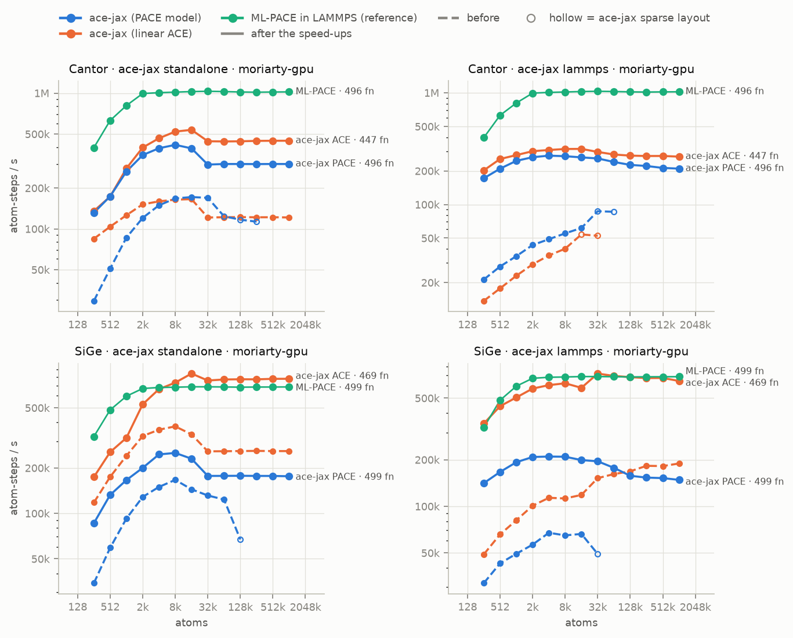

*ace-jax throughput before (dashed) and after (solid) the speed-ups, float64, medium models; ML-PACE in LAMMPS for reference. Before rows: `bench/scaling/results/before-perf/`. “fn”: basis functions per central element.*

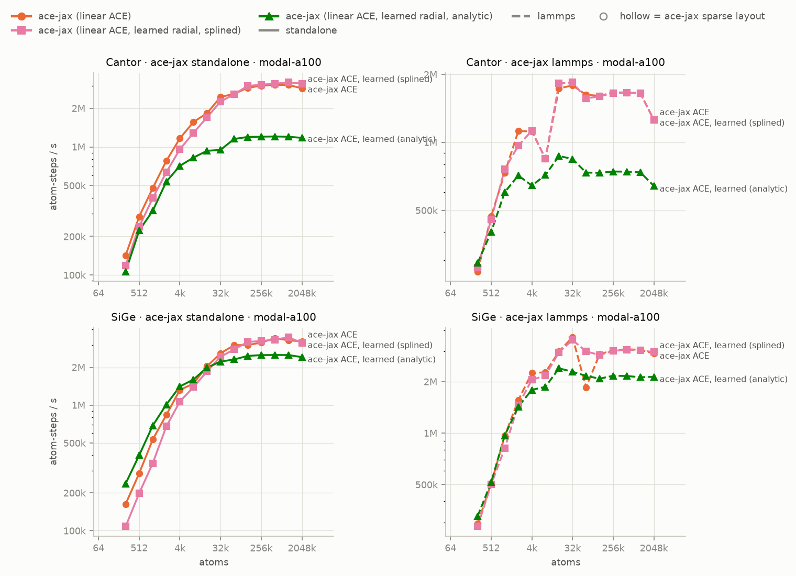

*The cost of a learned radial, and what splining recovers (float64, medium linear ACE): the stock model (spline radial), its learned-radial proxy splined as deployed (`spline_tol="auto"`, 1e-10) and the same proxy kept analytic (`spline_tol=None`, exact). Solid = standalone, dashed = LAMMPS; see `docs/dev/learned-radial-splining.md`.*

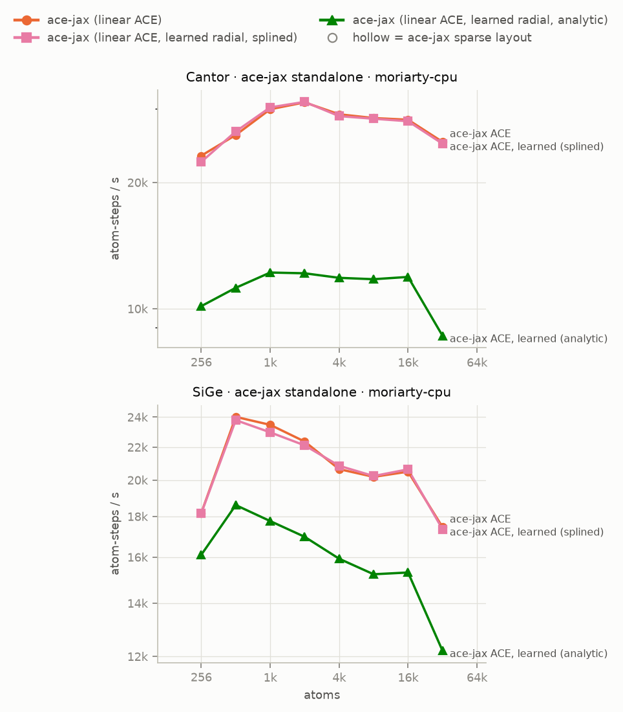

*The cost of a learned radial, and what splining recovers (float64, medium linear ACE): the stock model (spline radial), its learned-radial proxy splined as deployed (`spline_tol="auto"`, 1e-10) and the same proxy kept analytic (`spline_tol=None`, exact). Solid = standalone, dashed = LAMMPS; see `docs/dev/learned-radial-splining.md`.*

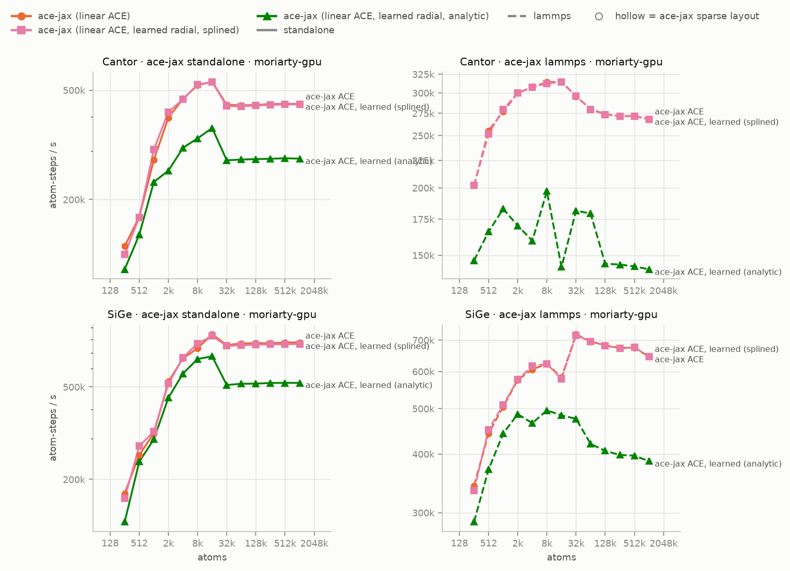

*The cost of a learned radial, and what splining recovers (float64, medium linear ACE): the stock model (spline radial), its learned-radial proxy splined as deployed (`spline_tol="auto"`, 1e-10) and the same proxy kept analytic (`spline_tol=None`, exact). Solid = standalone, dashed = LAMMPS; see `docs/dev/learned-radial-splining.md`.*

## Model basis sizes

| system | size | PACE | linear ACE | ACE / PACE |
|---|---|--:|--:|--:|
| Cantor | small | 96 | 126 | 1.3× |
| Cantor | medium | 496 | 447 | 0.9× |
| Cantor | large | 1998 | 1651 | 0.8× |
| SiGe | small | 100 | 101 | 1.0× |
| SiGe | medium | 499 | 469 | 0.9× |
| SiGe | large | 1684 | 1482 | 0.9× |

## Largest system that fits (medium, float64)

| host | system | code | mode | largest that ran | first out of memory |
|---|---|---|---|---|---|
| lestrade-cpu | Cantor | ace-jax (linear ACE) | standalone | 32768 | — |
| lestrade-cpu | Cantor | ace-jax (PACE model) | standalone | 32768 | — |
| lestrade-cpu | Cantor | ACEpotentials.jl (linear ACE, direct) | standalone | 32768 | — |
| lestrade-cpu | Cantor | ACEpotentials.jl (linear ACE, trim library in LAMMPS) | lammps | 32768 | — |
| lestrade-cpu | Cantor | MACE | lammps | 8192 | 16384 |
| lestrade-cpu | Cantor | MACE | standalone | 4096 | 8192 |
| lestrade-cpu | Cantor | ML-PACE | lammps | 32768 | — |
| lestrade-cpu | SiGe | ace-jax (linear ACE) | standalone | 32768 | — |
| lestrade-cpu | SiGe | ace-jax (PACE model) | standalone | 32768 | — |
| lestrade-cpu | SiGe | ACEpotentials.jl (linear ACE, direct) | standalone | 32768 | — |
| lestrade-cpu | SiGe | ACEpotentials.jl (linear ACE, trim library in LAMMPS) | lammps | 32768 | — |
| lestrade-cpu | SiGe | MACE | lammps | 8192 | 16384 |
| lestrade-cpu | SiGe | MACE | standalone | 8192 | 16384 |
| lestrade-cpu | SiGe | ML-PACE | lammps | 32768 | — |
| modal-a100 | Cantor | ace-jax (linear ACE) | lammps | 2097152 | — |
| modal-a100 | Cantor | ace-jax (linear ACE) | standalone | 2097152 | — |
| modal-a100 | Cantor | ace-jax (linear ACE, learned radial, analytic) | lammps | 2097152 | — |
| modal-a100 | Cantor | ace-jax (linear ACE, learned radial, analytic) | standalone | 2097152 | — |
| modal-a100 | Cantor | ace-jax (linear ACE, learned radial, splined) | lammps | 2097152 | — |
| modal-a100 | Cantor | ace-jax (linear ACE, learned radial, splined) | standalone | 2097152 | — |
| modal-a100 | Cantor | ace-jax (PACE model) | lammps | 2097152 | — |
| modal-a100 | Cantor | ace-jax (PACE model) | standalone | 2097152 | — |
| modal-a100 | Cantor | MACE | lammps | 16384 | 32768 |
| modal-a100 | Cantor | MACE | standalone | 32768 | 65536 |
| modal-a100 | Cantor | ML-PACE | lammps | 2097152 | — |
| modal-a100 | SiGe | ace-jax (linear ACE) | lammps | 2097152 | — |
| modal-a100 | SiGe | ace-jax (linear ACE) | standalone | 2097152 | — |
| modal-a100 | SiGe | ace-jax (linear ACE, learned radial, analytic) | lammps | 2097152 | — |
| modal-a100 | SiGe | ace-jax (linear ACE, learned radial, analytic) | standalone | 2097152 | — |
| modal-a100 | SiGe | ace-jax (linear ACE, learned radial, splined) | lammps | 2097152 | — |
| modal-a100 | SiGe | ace-jax (linear ACE, learned radial, splined) | standalone | 2097152 | — |
| modal-a100 | SiGe | ace-jax (PACE model) | lammps | 2097152 | — |
| modal-a100 | SiGe | ace-jax (PACE model) | standalone | 2097152 | — |
| modal-a100 | SiGe | MACE | lammps | 16384 | 32768 |
| modal-a100 | SiGe | MACE | standalone | 32768 | 65536 |
| modal-a100 | SiGe | ML-PACE | lammps | 2097152 | — |
| moriarty-cpu | Cantor | ace-jax (linear ACE) | standalone | 32768 | — |
| moriarty-cpu | Cantor | ace-jax (linear ACE, learned radial, analytic) | standalone | 32768 | — |
| moriarty-cpu | Cantor | ace-jax (linear ACE, learned radial, splined) | standalone | 32768 | — |
| moriarty-cpu | Cantor | ace-jax (PACE model) | standalone | 32768 | — |
| moriarty-cpu | Cantor | MACE | lammps | 16384 | 32768 |
| moriarty-cpu | Cantor | MACE | standalone | 4096 | 8192 |
| moriarty-cpu | Cantor | ML-PACE | lammps | 32768 | — |
| moriarty-cpu | SiGe | ace-jax (linear ACE) | standalone | 32768 | — |
| moriarty-cpu | SiGe | ace-jax (linear ACE, learned radial, analytic) | standalone | 32768 | — |
| moriarty-cpu | SiGe | ace-jax (linear ACE, learned radial, splined) | standalone | 32768 | — |
| moriarty-cpu | SiGe | ace-jax (PACE model) | standalone | 32768 | — |
| moriarty-cpu | SiGe | MACE | lammps | 8192 | 16384 |
| moriarty-cpu | SiGe | MACE | standalone | 8192 | 16384 |
| moriarty-cpu | SiGe | ML-PACE | lammps | 32768 | — |
| moriarty-gpu | Cantor | ace-jax (linear ACE) | lammps | 1048576 | — |
| moriarty-gpu | Cantor | ace-jax (linear ACE) | standalone | 1048576 | — |
| moriarty-gpu | Cantor | ace-jax (linear ACE, learned radial, analytic) | lammps | 1048576 | — |
| moriarty-gpu | Cantor | ace-jax (linear ACE, learned radial, analytic) | standalone | 1048576 | — |
| moriarty-gpu | Cantor | ace-jax (linear ACE, learned radial, splined) | lammps | 1048576 | — |
| moriarty-gpu | Cantor | ace-jax (linear ACE, learned radial, splined) | standalone | 1048576 | — |
| moriarty-gpu | Cantor | ace-jax (PACE model) | lammps | 1048576 | — |
| moriarty-gpu | Cantor | ace-jax (PACE model) | standalone | 1048576 | — |
| moriarty-gpu | Cantor | MACE | lammps | 4096 | 8192 |
| moriarty-gpu | Cantor | MACE | standalone | 8192 | 16384 |
| moriarty-gpu | Cantor | ML-PACE | lammps | 1048576 | — |
| moriarty-gpu | SiGe | ace-jax (linear ACE) | lammps | 1048576 | — |
| moriarty-gpu | SiGe | ace-jax (linear ACE) | standalone | 1048576 | — |
| moriarty-gpu | SiGe | ace-jax (linear ACE, learned radial, analytic) | lammps | 1048576 | — |
| moriarty-gpu | SiGe | ace-jax (linear ACE, learned radial, analytic) | standalone | 1048576 | — |
| moriarty-gpu | SiGe | ace-jax (linear ACE, learned radial, splined) | lammps | 1048576 | — |
| moriarty-gpu | SiGe | ace-jax (linear ACE, learned radial, splined) | standalone | 1048576 | — |
| moriarty-gpu | SiGe | ace-jax (PACE model) | lammps | 1048576 | — |
| moriarty-gpu | SiGe | ace-jax (PACE model) | standalone | 1048576 | — |
| moriarty-gpu | SiGe | MACE | lammps | 4096 | 8192 |
| moriarty-gpu | SiGe | MACE | standalone | 8192 | 16384 |
| moriarty-gpu | SiGe | ML-PACE | lammps | 1048576 | — |

## Tables

±x%: half the min–max range over the median, where a case was run more than once.

| host | system | code | mode | size | dtype | atoms | atom-steps/s |
|---|---|---|---|---|---|---|---|
| lestrade-cpu | Cantor | ace-jax (linear ACE) | standalone | large | float64 | 2048 | 1.51e+04 |
| lestrade-cpu | SiGe | ace-jax (linear ACE) | standalone | large | float64 | 2048 | 7.68e+03 |
| lestrade-cpu | Cantor | ace-jax (linear ACE) | standalone | medium | float64 | 2048 | 5.26e+04 |
| lestrade-cpu | SiGe | ace-jax (linear ACE) | standalone | medium | float64 | 2048 | 3.5e+04 |
| lestrade-cpu | Cantor | ace-jax (linear ACE) | standalone | small | float64 | 2048 | 1.21e+05 |
| lestrade-cpu | SiGe | ace-jax (linear ACE) | standalone | small | float64 | 2048 | 1.77e+05 |
| lestrade-cpu | Cantor | ace-jax (PACE model) | standalone | large | float64 | 2048 | 1.15e+04 |
| lestrade-cpu | SiGe | ace-jax (PACE model) | standalone | large | float64 | 2048 | 5.91e+03 |
| lestrade-cpu | Cantor | ace-jax (PACE model) | standalone | medium | float64 | 2048 | 4.03e+04 |
| lestrade-cpu | SiGe | ace-jax (PACE model) | standalone | medium | float64 | 2048 | 2.52e+04 |
| lestrade-cpu | Cantor | ace-jax (PACE model) | standalone | small | float64 | 2048 | 1.1e+05 |
| lestrade-cpu | SiGe | ace-jax (PACE model) | standalone | small | float64 | 2048 | 9.78e+04 |
| lestrade-cpu | Cantor | ACEpotentials.jl (linear ACE, direct) | standalone | large | float64 | 2048 | 4.6e+04 |
| lestrade-cpu | SiGe | ACEpotentials.jl (linear ACE, direct) | standalone | large | float64 | 2048 | 5.21e+04 |
| lestrade-cpu | Cantor | ACEpotentials.jl (linear ACE, direct) | standalone | medium | float64 | 2048 | 5.17e+04 |
| lestrade-cpu | SiGe | ACEpotentials.jl (linear ACE, direct) | standalone | medium | float64 | 2048 | 8.45e+04 |
| lestrade-cpu | Cantor | ACEpotentials.jl (linear ACE, direct) | standalone | small | float64 | 2048 | 6.84e+04 |
| lestrade-cpu | SiGe | ACEpotentials.jl (linear ACE, direct) | standalone | small | float64 | 2048 | 7.91e+04 |
| lestrade-cpu | Cantor | ACEpotentials.jl (linear ACE, trim library in LAMMPS) | lammps | large | float64 | 2048 | 6.22e+05 |
| lestrade-cpu | SiGe | ACEpotentials.jl (linear ACE, trim library in LAMMPS) | lammps | large | float64 | 2048 | 4.52e+05 |
| lestrade-cpu | Cantor | ACEpotentials.jl (linear ACE, trim library in LAMMPS) | lammps | medium | float64 | 2048 | 9.36e+05 |
| lestrade-cpu | SiGe | ACEpotentials.jl (linear ACE, trim library in LAMMPS) | lammps | medium | float64 | 2048 | 1.04e+06 |
| lestrade-cpu | Cantor | ACEpotentials.jl (linear ACE, trim library in LAMMPS) | lammps | small | float64 | 2048 | 1.37e+06 |
| lestrade-cpu | SiGe | ACEpotentials.jl (linear ACE, trim library in LAMMPS) | lammps | small | float64 | 2048 | 2.12e+06 |
| lestrade-cpu | Cantor | MACE | lammps | large | float64 | 2048 | 946 |
| lestrade-cpu | SiGe | MACE | lammps | large | float64 | 2048 | 1.13e+03 |
| lestrade-cpu | Cantor | MACE | lammps | medium | float64 | 2048 | 2.91e+03 |
| lestrade-cpu | SiGe | MACE | lammps | medium | float64 | 2048 | 3.91e+03 |
| lestrade-cpu | Cantor | MACE | lammps | small | float64 | 2048 | 8.55e+03 |
| lestrade-cpu | SiGe | MACE | lammps | small | float64 | 2048 | 1.09e+04 |
| lestrade-cpu | Cantor | MACE | standalone | large | float64 | 2048 | 125 |
| lestrade-cpu | SiGe | MACE | standalone | large | float64 | 2048 | 154 |
| lestrade-cpu | Cantor | MACE | standalone | medium | float64 | 2048 | 266 |
| lestrade-cpu | SiGe | MACE | standalone | medium | float64 | 2048 | 331 |
| lestrade-cpu | Cantor | MACE | standalone | mh1 | float64 | 2048 | 118 |
| lestrade-cpu | SiGe | MACE | standalone | mh1 | float64 | 2048 | 166 |
| lestrade-cpu | Cantor | MACE | standalone | small | float64 | 2048 | 663 |
| lestrade-cpu | SiGe | MACE | standalone | small | float64 | 2048 | 841 |
| lestrade-cpu | Cantor | ML-PACE | lammps | large | float64 | 2048 | 2.17e+05 |
| lestrade-cpu | SiGe | ML-PACE | lammps | large | float64 | 2048 | 1.75e+05 |
| lestrade-cpu | Cantor | ML-PACE | lammps | medium | float64 | 2048 | 5.62e+05 |
| lestrade-cpu | SiGe | ML-PACE | lammps | medium | float64 | 2048 | 4.17e+05 |
| lestrade-cpu | Cantor | ML-PACE | lammps | small | float64 | 2048 | 1.4e+06 |
| lestrade-cpu | SiGe | ML-PACE | lammps | small | float64 | 2048 | 7.69e+05 |
| modal-a100 | Cantor | ace-jax (linear ACE) | lammps | large | float64 | 8192 | 1.27e+06 |
| modal-a100 | SiGe | ace-jax (linear ACE) | lammps | large | float64 | 8192 | 1.39e+06 |
| modal-a100 | Cantor | ace-jax (linear ACE) | lammps | medium | float64 | 8192 | 8.47e+05 |
| modal-a100 | SiGe | ace-jax (linear ACE) | lammps | medium | float64 | 8192 | 2.27e+06 |
| modal-a100 | Cantor | ace-jax (linear ACE) | lammps | small | float64 | 8192 | 9.48e+05 |
| modal-a100 | SiGe | ace-jax (linear ACE) | lammps | small | float64 | 8192 | 3.39e+06 |
| modal-a100 | Cantor | ace-jax (linear ACE) | standalone | large | float64 | 8192 | 1.55e+06 |
| modal-a100 | SiGe | ace-jax (linear ACE) | standalone | large | float64 | 8192 | 1.03e+06 |
| modal-a100 | Cantor | ace-jax (linear ACE) | standalone | medium | float64 | 8192 | 1.56e+06 |
| modal-a100 | SiGe | ace-jax (linear ACE) | standalone | medium | float64 | 8192 | 1.48e+06 |
| modal-a100 | Cantor | ace-jax (linear ACE) | standalone | small | float64 | 8192 | 1.88e+06 |
| modal-a100 | SiGe | ace-jax (linear ACE) | standalone | small | float64 | 8192 | 2.07e+06 |
| modal-a100 | Cantor | ace-jax (linear ACE, learned radial, analytic) | lammps | medium | float64 | 8192 | 7.16e+05 |
| modal-a100 | SiGe | ace-jax (linear ACE, learned radial, analytic) | lammps | medium | float64 | 8192 | 1.86e+06 |
| modal-a100 | Cantor | ace-jax (linear ACE, learned radial, analytic) | standalone | medium | float64 | 8192 | 8.25e+05 |
| modal-a100 | SiGe | ace-jax (linear ACE, learned radial, analytic) | standalone | medium | float64 | 8192 | 1.6e+06 |
| modal-a100 | Cantor | ace-jax (linear ACE, learned radial, splined) | lammps | medium | float64 | 8192 | 8.44e+05 |
| modal-a100 | SiGe | ace-jax (linear ACE, learned radial, splined) | lammps | medium | float64 | 8192 | 2.17e+06 |
| modal-a100 | Cantor | ace-jax (linear ACE, learned radial, splined) | standalone | medium | float64 | 8192 | 1.29e+06 |
| modal-a100 | SiGe | ace-jax (linear ACE, learned radial, splined) | standalone | medium | float64 | 8192 | 1.39e+06 |
| modal-a100 | Cantor | ace-jax (PACE model) | lammps | large | float64 | 8192 | 4.92e+05 |
| modal-a100 | SiGe | ace-jax (PACE model) | lammps | large | float64 | 8192 | 3.75e+05 |
| modal-a100 | Cantor | ace-jax (PACE model) | lammps | medium | float64 | 8192 | 1.4e+06 |
| modal-a100 | SiGe | ace-jax (PACE model) | lammps | medium | float64 | 8192 | 1.14e+06 |
| modal-a100 | Cantor | ace-jax (PACE model) | lammps | small | float64 | 8192 | 2.28e+06 |
| modal-a100 | SiGe | ace-jax (PACE model) | lammps | small | float64 | 8192 | 2.4e+06 |
| modal-a100 | Cantor | ace-jax (PACE model) | standalone | large | float64 | 8192 | 5.2e+05 ±2% |
| modal-a100 | SiGe | ace-jax (PACE model) | standalone | large | float64 | 8192 | 3.31e+05 |
| modal-a100 | Cantor | ace-jax (PACE model) | standalone | medium | float64 | 8192 | 1.26e+06 ±4% |
| modal-a100 | SiGe | ace-jax (PACE model) | standalone | medium | float64 | 8192 | 7.14e+05 |
| modal-a100 | Cantor | ace-jax (PACE model) | standalone | small | float64 | 8192 | 1.74e+06 ±20% |
| modal-a100 | SiGe | ace-jax (PACE model) | standalone | small | float64 | 8192 | 1.78e+06 ±0% |
| modal-a100 | Cantor | MACE | lammps | large | float64 | 8192 | 2.49e+04 |
| modal-a100 | SiGe | MACE | lammps | large | float64 | 8192 | 2.97e+04 |
| modal-a100 | Cantor | MACE | lammps | medium | float64 | 8192 | 5.45e+04 |
| modal-a100 | SiGe | MACE | lammps | medium | float64 | 8192 | 6.39e+04 |
| modal-a100 | Cantor | MACE | lammps | small | float64 | 8192 | 1.35e+05 |
| modal-a100 | SiGe | MACE | lammps | small | float64 | 8192 | 1.67e+05 |
| modal-a100 | Cantor | MACE | standalone | large | float64 | 8192 | 1.85e+04 |
| modal-a100 | SiGe | MACE | standalone | large | float64 | 8192 | 2.74e+04 |
| modal-a100 | Cantor | MACE | standalone | medium | float64 | 8192 | 2.16e+04 |
| modal-a100 | SiGe | MACE | standalone | medium | float64 | 8192 | 3.12e+04 |
| modal-a100 | Cantor | MACE | standalone | mh1 | float64 | 8192 | 9.35e+03 |
| modal-a100 | SiGe | MACE | standalone | mh1 | float64 | 8192 | 1.73e+04 |
| modal-a100 | Cantor | MACE | standalone | small | float64 | 8192 | 2.38e+04 |
| modal-a100 | SiGe | MACE | standalone | small | float64 | 8192 | 3.35e+04 |
| modal-a100 | Cantor | ML-PACE | lammps | large | float64 | 8192 | 7.17e+05 |
| modal-a100 | SiGe | ML-PACE | lammps | large | float64 | 8192 | 4.89e+05 |
| modal-a100 | Cantor | ML-PACE | lammps | medium | float64 | 8192 | 2.22e+06 |
| modal-a100 | SiGe | ML-PACE | lammps | medium | float64 | 8192 | 1.67e+06 |
| modal-a100 | Cantor | ML-PACE | lammps | small | float64 | 8192 | 5.14e+06 |
| modal-a100 | SiGe | ML-PACE | lammps | small | float64 | 8192 | 3.47e+06 |
| moriarty-cpu | Cantor | ace-jax (linear ACE) | standalone | large | float64 | 2048 | 1.13e+04 |
| moriarty-cpu | SiGe | ace-jax (linear ACE) | standalone | large | float64 | 2048 | 6.34e+03 |
| moriarty-cpu | Cantor | ace-jax (linear ACE) | standalone | medium | float64 | 2048 | 3.1e+04 |
| moriarty-cpu | SiGe | ace-jax (linear ACE) | standalone | medium | float64 | 2048 | 2.24e+04 |
| moriarty-cpu | Cantor | ace-jax (linear ACE) | standalone | small | float64 | 2048 | 6.22e+04 |
| moriarty-cpu | SiGe | ace-jax (linear ACE) | standalone | small | float64 | 2048 | 7.91e+04 |
| moriarty-cpu | Cantor | ace-jax (linear ACE, learned radial, analytic) | standalone | medium | float64 | 2048 | 1.21e+04 |
| moriarty-cpu | SiGe | ace-jax (linear ACE, learned radial, analytic) | standalone | medium | float64 | 2048 | 1.7e+04 |
| moriarty-cpu | Cantor | ace-jax (linear ACE, learned radial, splined) | standalone | medium | float64 | 2048 | 3.11e+04 |
| moriarty-cpu | SiGe | ace-jax (linear ACE, learned radial, splined) | standalone | medium | float64 | 2048 | 2.21e+04 |
| moriarty-cpu | Cantor | ace-jax (PACE model) | standalone | large | float64 | 2048 | 7.51e+03 |
| moriarty-cpu | SiGe | ace-jax (PACE model) | standalone | large | float64 | 2048 | 4.39e+03 |
| moriarty-cpu | Cantor | ace-jax (PACE model) | standalone | medium | float64 | 2048 | 2.29e+04 |
| moriarty-cpu | SiGe | ace-jax (PACE model) | standalone | medium | float64 | 2048 | 1.58e+04 |
| moriarty-cpu | Cantor | ace-jax (PACE model) | standalone | small | float64 | 2048 | 4.99e+04 |
| moriarty-cpu | SiGe | ace-jax (PACE model) | standalone | small | float64 | 2048 | 4.54e+04 |
| moriarty-cpu | Cantor | MACE | lammps | large | float64 | 2048 | 731 |
| moriarty-cpu | SiGe | MACE | lammps | large | float64 | 2048 | 866 |
| moriarty-cpu | Cantor | MACE | lammps | medium | float64 | 2048 | 1.77e+03 |
| moriarty-cpu | SiGe | MACE | lammps | medium | float64 | 2048 | 2.23e+03 |
| moriarty-cpu | Cantor | MACE | lammps | small | float64 | 2048 | 4.91e+03 |
| moriarty-cpu | SiGe | MACE | lammps | small | float64 | 2048 | 6.18e+03 |
| moriarty-cpu | Cantor | MACE | standalone | large | float64 | 2048 | 96.1 |
| moriarty-cpu | SiGe | MACE | standalone | large | float64 | 2048 | 115 |
| moriarty-cpu | Cantor | MACE | standalone | medium | float64 | 2048 | 201 |
| moriarty-cpu | SiGe | MACE | standalone | medium | float64 | 2048 | 243 |
| moriarty-cpu | Cantor | MACE | standalone | mh1 | float64 | 2048 | 93.2 |
| moriarty-cpu | SiGe | MACE | standalone | mh1 | float64 | 2048 | 130 |
| moriarty-cpu | Cantor | MACE | standalone | small | float64 | 2048 | 517 |
| moriarty-cpu | SiGe | MACE | standalone | small | float64 | 2048 | 637 |
| moriarty-cpu | Cantor | ML-PACE | lammps | large | float64 | 2048 | 1.09e+05 |
| moriarty-cpu | SiGe | ML-PACE | lammps | large | float64 | 2048 | 8.85e+04 |
| moriarty-cpu | Cantor | ML-PACE | lammps | medium | float64 | 2048 | 2.75e+05 |
| moriarty-cpu | SiGe | ML-PACE | lammps | medium | float64 | 2048 | 2.08e+05 |
| moriarty-cpu | Cantor | ML-PACE | lammps | small | float64 | 2048 | 7.45e+05 |
| moriarty-cpu | SiGe | ML-PACE | lammps | small | float64 | 2048 | 4.13e+05 |
| moriarty-gpu | Cantor | ace-jax (linear ACE) | lammps | large | float64 | 8192 | 3.89e+05 |
| moriarty-gpu | SiGe | ace-jax (linear ACE) | lammps | large | float64 | 8192 | 3.33e+05 |
| moriarty-gpu | Cantor | ace-jax (linear ACE) | lammps | medium | float64 | 8192 | 3.14e+05 |
| moriarty-gpu | SiGe | ace-jax (linear ACE) | lammps | medium | float64 | 8192 | 6.23e+05 |
| moriarty-gpu | Cantor | ace-jax (linear ACE) | lammps | small | float64 | 8192 | 5.25e+05 |
| moriarty-gpu | SiGe | ace-jax (linear ACE) | lammps | small | float64 | 8192 | 9.64e+05 |
| moriarty-gpu | Cantor | ace-jax (linear ACE) | standalone | large | float64 | 8192 | 5.67e+05 |
| moriarty-gpu | SiGe | ace-jax (linear ACE) | standalone | large | float64 | 8192 | 4.12e+05 |
| moriarty-gpu | Cantor | ace-jax (linear ACE) | standalone | medium | float64 | 8192 | 5.21e+05 |
| moriarty-gpu | SiGe | ace-jax (linear ACE) | standalone | medium | float64 | 8192 | 7.34e+05 |
| moriarty-gpu | Cantor | ace-jax (linear ACE) | standalone | small | float64 | 8192 | 7.82e+05 |
| moriarty-gpu | SiGe | ace-jax (linear ACE) | standalone | small | float64 | 8192 | 9.54e+05 |
| moriarty-gpu | Cantor | ace-jax (linear ACE, learned radial, analytic) | lammps | medium | float64 | 8192 | 1.97e+05 |
| moriarty-gpu | SiGe | ace-jax (linear ACE, learned radial, analytic) | lammps | medium | float64 | 8192 | 4.96e+05 |
| moriarty-gpu | Cantor | ace-jax (linear ACE, learned radial, analytic) | standalone | medium | float64 | 8192 | 3.34e+05 |
| moriarty-gpu | SiGe | ace-jax (linear ACE, learned radial, analytic) | standalone | medium | float64 | 8192 | 6.6e+05 |
| moriarty-gpu | Cantor | ace-jax (linear ACE, learned radial, splined) | lammps | medium | float64 | 8192 | 3.12e+05 |
| moriarty-gpu | SiGe | ace-jax (linear ACE, learned radial, splined) | lammps | medium | float64 | 8192 | 6.22e+05 |
| moriarty-gpu | Cantor | ace-jax (linear ACE, learned radial, splined) | standalone | medium | float64 | 8192 | 5.24e+05 |
| moriarty-gpu | SiGe | ace-jax (linear ACE, learned radial, splined) | standalone | medium | float64 | 8192 | 7.68e+05 |
| moriarty-gpu | Cantor | ace-jax (PACE model) | lammps | large | float64 | 8192 | 8.2e+04 |
| moriarty-gpu | SiGe | ace-jax (PACE model) | lammps | large | float64 | 8192 | 8.72e+04 |
| moriarty-gpu | Cantor | ace-jax (PACE model) | lammps | medium | float64 | 8192 | 2.71e+05 |
| moriarty-gpu | SiGe | ace-jax (PACE model) | lammps | medium | float64 | 8192 | 2.09e+05 |
| moriarty-gpu | Cantor | ace-jax (PACE model) | lammps | small | float64 | 8192 | 6.54e+05 |
| moriarty-gpu | SiGe | ace-jax (PACE model) | lammps | small | float64 | 8192 | 6.35e+05 |
| moriarty-gpu | Cantor | ace-jax (PACE model) | standalone | large | float64 | 8192 | 1.19e+05 |
| moriarty-gpu | SiGe | ace-jax (PACE model) | standalone | large | float64 | 8192 | 9.66e+04 |
| moriarty-gpu | Cantor | ace-jax (PACE model) | standalone | medium | float64 | 8192 | 4.16e+05 |
| moriarty-gpu | SiGe | ace-jax (PACE model) | standalone | medium | float64 | 8192 | 2.51e+05 |
| moriarty-gpu | Cantor | ace-jax (PACE model) | standalone | small | float64 | 8192 | 9.73e+05 |
| moriarty-gpu | SiGe | ace-jax (PACE model) | standalone | small | float64 | 8192 | 7.69e+05 |
| moriarty-gpu | Cantor | MACE | lammps | large | float64 | 2048 | 4.09e+03 |
| moriarty-gpu | SiGe | MACE | lammps | large | float64 | 2048 | 5.48e+03 |
| moriarty-gpu | Cantor | MACE | lammps | medium | float64 | 4096 | 9.54e+03 |
| moriarty-gpu | SiGe | MACE | lammps | medium | float64 | 4096 | 1.25e+04 |
| moriarty-gpu | Cantor | MACE | lammps | small | float64 | 8192 | 2.86e+04 |
| moriarty-gpu | SiGe | MACE | lammps | small | float64 | 8192 | 3.71e+04 |
| moriarty-gpu | Cantor | MACE | standalone | large | float64 | 8192 | 3.01e+03 |
| moriarty-gpu | SiGe | MACE | standalone | large | float64 | 8192 | 3.81e+03 |
| moriarty-gpu | Cantor | MACE | standalone | medium | float64 | 8192 | 4.14e+03 |
| moriarty-gpu | SiGe | MACE | standalone | medium | float64 | 8192 | 5.08e+03 |
| moriarty-gpu | Cantor | MACE | standalone | mh1 | float64 | 2048 | 1.21e+03 |
| moriarty-gpu | SiGe | MACE | standalone | mh1 | float64 | 4096 | 2.06e+03 |
| moriarty-gpu | Cantor | MACE | standalone | small | float64 | 8192 | 5.5e+03 |
| moriarty-gpu | SiGe | MACE | standalone | small | float64 | 8192 | 6.49e+03 |
| moriarty-gpu | Cantor | ML-PACE | lammps | large | float64 | 8192 | 2.88e+05 |
| moriarty-gpu | SiGe | ML-PACE | lammps | large | float64 | 8192 | 1.89e+05 |
| moriarty-gpu | Cantor | ML-PACE | lammps | medium | float64 | 8192 | 1.02e+06 |
| moriarty-gpu | SiGe | ML-PACE | lammps | medium | float64 | 8192 | 6.84e+05 |
| moriarty-gpu | Cantor | ML-PACE | lammps | small | float64 | 8192 | 3.54e+06 |
| moriarty-gpu | SiGe | ML-PACE | lammps | small | float64 | 8192 | 1.94e+06 |

| host | code | mode | median compile / export (s) |
|---|---|---|---|
| lestrade-cpu | ace-jax (linear ACE) | standalone | 0.5 |
| lestrade-cpu | ace-jax (PACE model) | standalone | 0.7 |
| lestrade-cpu | ACEpotentials.jl (linear ACE, direct) | standalone | 0.6 |
| lestrade-cpu | MACE | standalone | 4.0 |
| modal-a100 | ace-jax (linear ACE) | lammps | 2.1 |
| modal-a100 | ace-jax (linear ACE) | standalone | 4.5 |
| modal-a100 | ace-jax (linear ACE, learned radial, analytic) | lammps | 2.3 |
| modal-a100 | ace-jax (linear ACE, learned radial, analytic) | standalone | 6.0 |
| modal-a100 | ace-jax (linear ACE, learned radial, splined) | lammps | 3.6 |
| modal-a100 | ace-jax (linear ACE, learned radial, splined) | standalone | 4.9 |
| modal-a100 | ace-jax (PACE model) | lammps | 1.6 |
| modal-a100 | ace-jax (PACE model) | standalone | 10.2 |
| modal-a100 | MACE | standalone | 9.8 |
| moriarty-cpu | ace-jax (linear ACE) | standalone | 1.3 |
| moriarty-cpu | ace-jax (linear ACE, learned radial, analytic) | standalone | 1.3 |
| moriarty-cpu | ace-jax (linear ACE, learned radial, splined) | standalone | 1.2 |
| moriarty-cpu | ace-jax (PACE model) | standalone | 1.7 |
| moriarty-cpu | MACE | standalone | 5.6 |
| moriarty-gpu | ace-jax (linear ACE) | lammps | 1.2 |
| moriarty-gpu | ace-jax (linear ACE) | standalone | 3.3 |
| moriarty-gpu | ace-jax (linear ACE, learned radial, analytic) | lammps | 1.4 |
| moriarty-gpu | ace-jax (linear ACE, learned radial, analytic) | standalone | 4.5 |
| moriarty-gpu | ace-jax (linear ACE, learned radial, splined) | lammps | 2.1 |
| moriarty-gpu | ace-jax (linear ACE, learned radial, splined) | standalone | 3.4 |
| moriarty-gpu | ace-jax (PACE model) | lammps | 1.3 |
| moriarty-gpu | ace-jax (PACE model) | standalone | 6.1 |
| moriarty-gpu | MACE | standalone | 12.5 |

## Versions

- **lestrade-cpu**: ACEpotentials 0.10.2, ACEpotentials_rev v0.10.2, EquivariantTensors 0.4.3, JuliaC 0.3.10, Polynomials4ML 0.5.8, ace-jax 0.1.0, ase 3.29.0, jax 0.11.2, jaxlib 0.11.2, julia 1.12.6, mace-torch 0.3.16, matscipy 1.2.0, matscipy-neighbours 0.1.0, python 3.12.8, torch 2.14.0
- **modal-a100**: ase 3.29.0, jax 0.11.2, jaxlib 0.11.2, mace-torch 0.3.16, matscipy 1.2.0, matscipy-neighbours 1.0.0, python 3.12.1, torch 2.14.0
- **moriarty-cpu**: ace-jax 0.1.0, ase 3.29.0, jax 0.11.2, jaxlib 0.11.2, mace-torch 0.3.16, matscipy 1.2.0, matscipy-neighbours 0.1.0, python 3.12.8, torch 2.14.0
- **moriarty-gpu**: ace-jax 0.1.0, ase 3.29.0, jax 0.11.2, jaxlib 0.11.2, mace-torch 0.3.16, matscipy 1.2.0, matscipy-neighbours 0.1.0, python 3.12.8, torch 2.14.0
