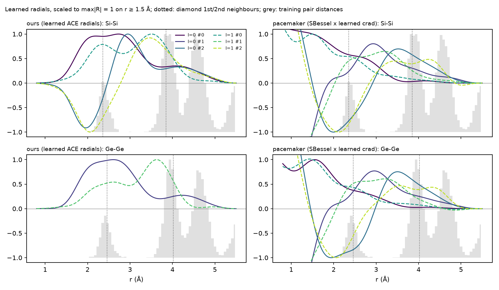

# Radials + sqrt(density) by VarPro: results

This note tests the joint radial and density learning of `docs/specs/2026-09-28-radial-density-varpro-design.md` against the success criteria in that spec. The data, splits, MACE teacher and QoI protocol are the same as in `docs/learn-radial-pacemaker-comparison.md`. Raw numbers are under `docs/figures/learn-radial/density/`, and `qoi_table.py` there regenerates the QoI tables.

## Summary

**Learned sqrt(ρ) features in a linear readout do not improve the vacancy energies.** The fitted readout of the density term stays close to zero, with d ≈ 10⁻³, whether or not vacancies are in the training data. The term then contributes about 1 meV per atom, and under 1 meV across a vacancy.

The reason is structural. With a full-span density ρ = η·X, sqrt(ρ₀+δ) ≈ const + δ/(2√ρ₀) + O(δ²), and the linear part δ already lies in the span of the linear ACE basis. The new column adds only the curvature, which the evidence-tuned ridge treats as a weak, redundant direction and shrinks. Pacemaker's sqrt(ρ) model gets vacancies right (+0.03/+0.14 eV) because its embedding has a fixed form with unit weights, so it is forced to use that curvature.

**Vacancy data is what moves the vacancy energy.** With 80 SiGe vacancy cells in training, the SiGe vacancy errors change as follows:

| SiGe vacancy error (eV) | Without vacancy data | With vacancy data |
|---|---|---|
| Si, 40 steps | about −1.5 | −0.4 to −0.5 |
| Si, 200 steps | about −1.5 | −0.66 to −0.82 |
| Ge | −0.6 to −1.1 | −0.11 to −0.38 |

For Cantor, 60 vacancy cells give a smaller change: the vacancy MAE goes from 0.41–0.48 to 0.34–0.47 eV. On both systems, more radial learning improves bulk accuracy at the vacancy's expense, because the objective has 150–200 bulk configurations against 60–80 defect ones.

**Success criteria from the spec:**

1. **SiGe vacancies within 0.3 eV of MACE: fails.** Ge meets it with vacancy data. Si does not: its best error is −0.43 eV, with a density at 40 steps.
2. **Elastic mean deviation ≤ 3%: holds.** It is 1.4–1.8% at 200 steps and 1.4–2.5% at 40 steps with vacancy data.
3. **RMSE no worse than radials-only: holds on SiGe.** Energies are within ±5% and forces up to 6% worse. On Cantor, the density costs 15% in energy and 5% in forces at 200 steps.
4. **Gate soundness: holds.**

**Optimiser.** The first joint preconditioner (a gradient-RMS ratio) failed on Cantor. The current curvature-matched scale, with a fallback to alternating blocks when a line search fails, completes its budget everywhere and gives the best density fits (see Optimiser).

## Setup

- **Runs.** `bench/learn_radial/modal_run.py` on A100-80GB, with n_q 12, lam_rough 0.1, `--reprofile-every 50` (the Modal default) and lam_eta 0.
- **Candidates.** Each run learns two candidates from the same start, split and step budget: radials-only, and radials + density. The held-out gate picks between them. Both candidates are evaluated below, whichever the gate picks.
- **RMSEs.** Measured on the saved model itself (`rmse_npz.py`, on the unchanged bulk validation split): energies in meV/atom, forces in meV/Å.
- **QoIs.** `qoi.py` against MACE-MH-1 (Si vacancy 3.65 eV, Ge 2.55 eV). SiGe QoIs were run on a Mac CPU and Cantor QoIs on lestrade.
- **Vacancy data, the second round.** It is added to the training split only (`run.py --extra-train`):
  - SiGe: `~/acegp-data/sige/sige_vac_mh1.xyz`, 80 cells of 63 atoms, a quarter pure Si and a quarter pure Ge, labelled with MACE-MH-1. The generator is `gen/make_sige_vac.py`.
  - Cantor: `~/acegp-data/cantor/cantor_vac_train_mh1.xyz`, the first 60 training vacancy cells of the defect benchmark.

  This round also uses `--tol 0`, so both candidates run their full step budget.
- **Run-to-run variation.** Radials-only candidates that should be identical differ by ≈1–2% across runs, from GPU nondeterminism. They are quoted as ranges.
- **Baseline.** Re-profiling θ every 50 steps makes these radials-only numbers differ from PR #14's (0.77 against 0.54 meV/atom at 40 steps). The comparison inside each run is like for like.

## SiGe

Vacancy columns are E_vac − E_vac(MACE) in eV. The elastic column is the mean |%| deviation over a₀, B, C11, C12 and C44 for Si, Ge and SiGe.

| Data | Budget | Model | E (meV/atom) | F (meV/Å) | Elastic \|%\| | Si vacancy (eV) | Ge vacancy (eV) |
|---|---|---|---|---|---|---|---|
| bulk | 40 | radials only | 0.774 | 44.54 | 4.0 | −1.52 | −0.84 |
| bulk | 40 | full, P=1 | 0.772 | 44.71 | 4.3 | −1.49 | −0.62 |
| bulk | 40 | full, P=2 | 0.801 | 45.07 | 3.9 | −1.51 | −0.62 |
| bulk | 40 | pair, P=1 | 0.784 | 44.76 | 4.6 | −1.56 | −0.59 |
| bulk | 200 | radials only | 0.536–0.541 | 36.12–36.26 | 1.3–1.6 | −1.48 to −1.57 | −1.11 to −1.14 |
| bulk | 200 | full, P=1 | 0.521 | 36.97 | 1.8 | −1.47 | −0.98 |
| bulk | 200 | full, P=2 | 0.525 | 37.41 | 1.7 | −1.46 | −0.94 |
| bulk | 200 | pair, P=1 | 0.536 | 36.79 | 1.4 | −1.48 | −1.04 |
| + vacancies | 40 | radials only | 0.817 | 45.65 | 2.5 | −0.51 | −0.38 |
| + vacancies | 40 | full, P=1 | 0.800 | 45.63 | 2.3 | −0.43 | −0.33 |
| + vacancies | 40 | full, P=2 | 0.748 | 46.87 | 1.4 | −0.49 | −0.27 |
| + vacancies | 200 | radials only | 0.621–0.639 | 36.30–36.35 | 1.7 | −0.81 | −0.11 to −0.15 |
| + vacancies | 200 | full, P=1 | 0.652 | 38.34 | 1.5 | −0.66 | −0.15 |
| + vacancies | 200 | full, P=2 | 0.629 | 38.12 | 1.6 | −0.82 | −0.20 |

For reference, pacemaker sqrt(ρ) (bulk data) scores Si +0.03, Ge +0.14 and 5.9% elastic.

The density readouts for Si are d ≈ −3×10⁻⁴ (bulk data, 200 steps, P=1) and −1.2×10⁻³ (with vacancies). In bulk, ρ = −1.215, and it moves to about −1.0 next to a vacancy, so the density does detect the defect. The term still contributes under 2 meV per atom and changes by under 0.3 meV across the vacancy, against a site-energy spread of 0.5–1.0 eV. The density runs' small vacancy differences therefore come from their different radial trajectories, not from the density term.

## Cantor

B and C44 are % deviations from MACE for the three random draws. The vacancy column is the MAE over 2 sites per species.

| Data, mode | Budget | Model | E (meV/atom) | F (meV/Å) | B % per draw | C44 % per draw | Vacancy MAE (eV) |
|---|---|---|---|---|---|---|---|
| bulk, joint | 40 | radials only | 7.46 | 148.7 | +10 / +13 / +1 | +2 / +8 / +24 | 0.48 |
| bulk, joint | 40 | full, P=1 | 7.86 | 150.4 | +11 / +13 / +7 | +3 / +9 / −10 | 0.44 |
| bulk, joint | 40 | full, P=2 | 10.47 | 152.6 | +16 / +9 / −1 | +8 / +11 / +29 | 0.29 |
| bulk, joint | 40 | pair, P=1 | 7.61 | 149.1 | +9 / +13 / +7 | +1 / +6 / −10 | 0.47 |
| bulk, joint | 200 | radials only | 6.21–6.30 | 120.0 | +13 to +16 | −7 to −11 | 0.41–0.42 |
| bulk, joint | 200 | full, P=1 (stopped at 100) | 7.58 | 145.2 | +11 / +12 / +10 | +2 / +5 / −11 | 0.45 |
| bulk, joint | 200 | full, P=2 (stopped at 50) | 10.56 | 152.7 | +16 / +8 / −1 | +8 / +10 / +29 | 0.29 |
| bulk, joint | 200 | pair, P=1 | 7.36 | 146.5 | +10 / +13 / +9 | +2 / +5 / −10 | 0.46 |
| + vacancies, joint | 40 | radials only | 7.12 | 146.6 | +1 / 0 / −13 | +1 / +2 / −23 | 0.34 |
| + vacancies, joint | 200 | radials only | 5.95–6.09 | 119.8–120.1 | 0 / 0 / −12 to −13 | −12 / −11 / +1 | 0.45–0.46 |
| + vacancies, joint | 200 | full, P=1 (line search failed at 11 steps) | 8.74 | 149.7 | +11 / +2 / −7 | +9 / +10 / +26 | 0.28 |
| + vacancies, alternating | 40 | full, P=1 | 7.14 | 150.1 | +4 / −1 / −12 | +3 / +4 / +21 | 0.37 |
| + vacancies, alternating | 40 | full, P=2 | 7.19 | 150.2 | +4 / −1 / −12 | +3 / +4 / +21 | 0.38 |
| + vacancies, alternating | 200 | radials only | 5.94–5.97 | 119.7–119.8 | 0 / 0 / −12 | −12 / −12 / +1 to +2 | 0.47 |
| + vacancies, alternating | 200 | full, P=1 | 6.82 | 125.7 | +1 / 0 / −12 | −11 / −10 / +4 | 0.44 |
| + vacancies, alternating | 200 | full, P=2 | 6.84 | 124.6 | +1 / −1 / −13 | −11 / −10 / +2 | 0.45 |

For reference, pacemaker linear κ=0.3 (bulk data) scores a vacancy MAE of 1.14 eV, with B off by −33 to −43%.

Once optimised properly (alternating mode, full budget), the density leaves the Cantor properties essentially unchanged: vacancy MAE 0.44–0.45 against 0.47 eV, and B and C44 within a few %. It costs about 15% in energy RMSE, partly because the radials get only half the steps. The low vacancy MAEs of the stalled joint runs (0.28–0.29 eV) come with near-initial radials and much worse bulk errors, so they are not a density effect.

## Optimiser

Cantor, with vacancy data, `--tol 0`. Errors are E in meV/atom and F in meV/Å on validation.

| Optimiser | Budget | 1 density: steps done | 1 density: E / F | 2 densities: steps done | 2 densities: E / F |
|---|---|---|---|---|---|
| joint, gradient-RMS scale (first version) | 200 | 11 (line search failed) | 8.74 / 149.7 | 55 (line search failed) | 6.59 / 142.2 |
| joint, curvature scale | 200 | 31 (line search failed) | 8.89 / 149.7 | 120 (line search failed) | 5.97 / 130.5 |
| joint, curvature scale + fallback (current) | 200 | 200 | 6.63 / 125.8 | 200 | **6.04 / 122.4** |
| alternating | 200 | 200 | 6.82 / 125.7 | 200 | 6.84 / 124.6 |
| joint, curvature scale + fallback | 40 | 40 (1 fallback) | 7.49 / 150.3 | 40 | 6.91 / 146.7 |

Radials-only on the same runs: 5.91–6.00 / 119.7–120.1 at 200 steps, 7.12 / 146.6 at 40.

**Why it failed.** The first preconditioner scaled the density block by the ratio of gradient RMS. On Cantor that gave r_η ≈ 3×10⁻³, and the resulting huge density steps broke the line search.

**The current scheme** has three parts:
- **Curvature scale.** r_η = √(|h_H|/|h_V|), from one Hessian-vector-product probe per block, projected off each row's scale gauge.
- **Clamp.** r_η ≥ 0.1.
- **Fallback.** A failed joint line search spends the rest of that round on alternating V and H blocks.

**How the pieces behave:**
- Curvature scaling alone rescued P=2. It did not rescue P=1, where the density block is nearly flat and the clamp is what sets r_η. Any single block scale is defeated by the non-smooth density coordinates there.
- The fallback makes joint mode complete its budget in every case.
- Joint mode then gives the closest density results to radials-only (P=2: 6.04 / 122.4), better than alternating, which spends only half its steps on the radials.
- On SiGe, curvature scaling is on par with the old scale: 0.665 / 37.8 against 0.652 / 38.3 at 200 steps (P=1, vacancy data).
- Identical configurations differ between runs from GPU nondeterminism; for example Cantor P=1 at 200 steps needed no fallback on its last run. The fallback covers both outcomes.

**Physical properties** of the best-optimised Cantor density models (200 steps, fallback):

| Model | Vacancy MAE (eV) | B % per draw | C44 % per draw |
|---|---|---|---|
| 1 density | 0.45 | 0 / −1 / −13 | −10 / −10 / +5 |
| 2 densities | 0.46 | 0 / −1 / −13 | −11 / −11 / +2 |
| radials only | 0.45–0.47 | — | — |

Once the density is properly optimised it changes the physical properties by nothing measurable, which confirms the collinearity argument in the summary.

**Cost.** A joint 50-step round took 145 s on SiGe (A100), against 101–128 s for radials alone. The curvature probe adds two Hessian-vector products per round, about 5 gradient evaluations.

## Spike: fixed-weight sqrt(ρ), as in pacemaker

This spike is throwaway code, `spike/fixed_fs*.py`, and is not on the branch. It fixes the weight on the sqrt term at 1, as pacemaker's `fs_parameters [1,1,1,0.5]` does:

E_i = c·X_i + √ρ_i + ΔE0_z

- There is no scale gauge, so the magnitude of η sets how much curvature the model is forced to carry.
- The fixed term is an offset on the targets, so the fit stays VarPro.
- Per-species count columns fit ΔE0. The √ρ term carries a per-site constant that the ACE basis, which has no constant function, cannot absorb; pacemaker absorbs it in its reference energies.
- η starts at 10⁻⁴ × the unit-mean-square pair density. Scaling η by s scales the term like √s but leaves the relative variation δρ/ρ unchanged, so a small start begins near the linear model. A start at 10⁻² stalls.
- SiGe, bulk data only, the same split as pacemaker.

| Model | E (meV/atom) | F (meV/Å) | Elastic \|%\| | Si vacancy (eV) | Ge vacancy (eV) |
|---|---|---|---|---|---|
| radials only (200 steps) | 0.536 | 36.2 | 1.6 | −1.57 | −1.14 |
| fixed √ρ, η learned, radials frozen | 0.549 | 36.5 | **0.8** | −1.55 | −1.11 |
| fixed √ρ + radials jointly (200 + 200 steps), pair span | **0.511** | 37.7 | 1.6 | −1.74 | −0.96 |
| fixed √ρ + radials jointly, full span | 0.546 | 36.7 | 1.8 | −2.00 | −0.90 |
| pacemaker linear, κ=0.02 | 0.85 | 32.2 | 5.9 | −0.74 | −0.52 |
| pacemaker linear, κ=0.3 | 1.07 | 28.7 | 7.7 | −1.08 | −0.19 |
| pacemaker √ρ, κ=0.3 | 0.94 | 26.5 | 5.9 | +0.03 | +0.14 |

**Unlike the fitted-weight version, the fixed-form term is used.**
- With frozen radials, the training residual drops 10% and the elastic deviation halves.
- The term is large, 2–18 eV per site depending on the variant, and varies by 0.05–1.0 eV across a vacancy's neighbours.

**The vacancies do not move.** The linear readout cancels most of the term's variation, and what remains is the curvature. That is small, because the learned densities stay smooth: near a vacancy ρ drops by only 5% (pair span), 11% (full span, frozen radials) or 16% (full span, joint). The √ curvature beyond the linear part, about (δρ/ρ)²/8·√ρ, is a few meV to tens of meV per neighbour. Bulk data gives the optimiser no reason to make ρ short-ranged and neighbour-counting. Learning the radials jointly does not change that.

**Most of the gap to pacemaker is not the embedding.** Even pacemaker's *linear* models get vacancies 0.5–0.95 eV closer to MACE than ours do. That points at the base model, meaning the radial basis and cutoff and the fit, rather than at the sqrt embedding.

## Spike: pacemaker's radials with our linear fit

Throwaway code: `spike/pace_refit*.py`. A linear pacemaker model (`ndensity 1`, `fs [1,1]`) is exactly linear in its C-tilde coefficients (checked: relative error 0).

- Keep pacemaker's learned radials (SBessel × `crad`), converted to `.yace` and evaluated by `PACEModel`.
- Refit the 3370 coefficients with our Bayesian linear fit: evidence-optimised σ_E, σ_F, σ_c, a per-species E0 shift, no virials, and the same split.
- Our evaluator reproduces pyace's QoIs for the original pacemaker models (κ=0.02: elastic 5.9%, Si −0.74, Ge −0.52 eV).

| SiGe, bulk data | E (meV/atom) | F (meV/Å) | Elastic \|%\| | Si vacancy (eV) | Ge vacancy (eV) |
|---|---|---|---|---|---|
| our radials (learned, 200 steps) + our fit | 0.536 | 36.2 | **1.6** | −1.57 | −1.14 |
| pacemaker radials (κ=0.02) + **our fit** | 0.86 | **31.3** | 6.0 | **−0.59** | **−0.38** |
| pacemaker radials (κ=0.1) + **our fit** | 0.91 | 30.7 | 7.0 | −0.58 | −0.41 |
| pacemaker κ=0.02, its own fit | 0.85 | 32.2 | 5.9 | −0.73 | −0.52 |
| pacemaker κ=0.1, its own fit | 0.97 | 31.1 | 6.7 | −0.74 | −0.44 |

**The radial basis accounts for most of the vacancy gap:** about 1 eV of the Si error and 0.75 eV of the Ge error. Our fitting procedure is not the problem: on the same radials, our evidence-weighted fit is slightly better than pacemaker's own, on both forces and vacancies. There is a trade-off between the two sets of radials. Ours are much better on elastic constants (1.6% against 6–7%) and worse on vacancies.

**Why the two sets of radials behave differently:**
- **Pacemaker's radials are short-ranged and steep through the first shell.** The leading l=0 radial falls monotonically from about 1.5 Å, through the first-neighbour peak, to about 0 by 3.3 Å. Other radials change sign between 1.5 and 2.5 Å.
- **Ours are flat through the first shell and long-ranged.** Our leading l=0 radial is a plateau from 2.1 to 2.8 Å and keeps about 35% of its weight over the second and third shells. It vanishes below 1.5 Å because of the envelope.

A vacancy is a first-shell event (one of four nearest neighbours is removed), so pacemaker's basis resolves it and ours dilutes it. The same dilution makes our learned densities barely react to vacancies. Since both sets of radials were fitted to the same data, the difference comes from the starting basis:
- ours: Legendre in the Agnesi coordinate, with the `poly2sx` envelope;
- pacemaker: SBessel with a distance cutoff.

VarPro at n_q = 12 changes the radials only modestly from where they start.

## Conclusions

1. **A linear readout over a learned sqrt(ρ) is not an FS embedding in practice.** The density column is nearly collinear with the linear ACE basis, the ridge suppresses it, and it neither helps nor hurts the physical properties. The rest of the linear-model advantages are unaffected: convex final fit, UQ and speed. So keeping the machinery is cheap, but on these data it does not buy vacancy accuracy.
2. **Training data sets the defect energies.** Adding vacancy cells cut the SiGe Si vacancy error by about 1 eV and brought Ge inside the 0.3 eV target, with no model change. The remaining Si error grows with longer radial learning, which suggests up-weighting the defect configurations, or adding more of them. That is cheap to test with the existing per-type noise machinery.
3. **Options for the density itself:**
   - A fixed-form embedding, as pacemaker does, would make the curvature count. That is nonlinear in the readout, which is the spec's fallback and gives up convexity.
   - Alternatively, a density span that excludes the linear basis's own columns, so the linear part of sqrt(ρ) is not already representable.

   Both are separate decisions.
4. **Optimiser.** Joint mode with the curvature-matched scale and the alternating fallback (the current default) is robust on both systems, and it is the best density optimiser measured.
