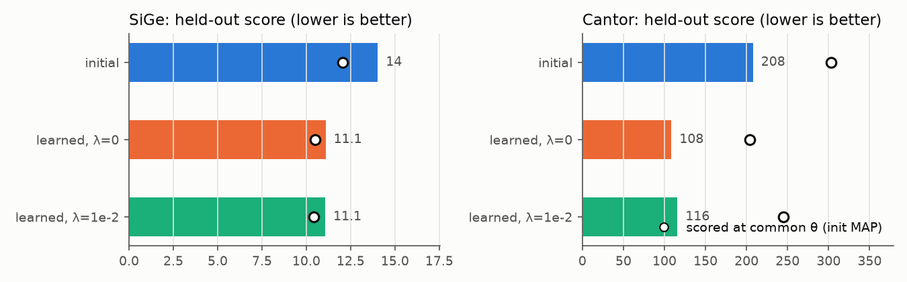
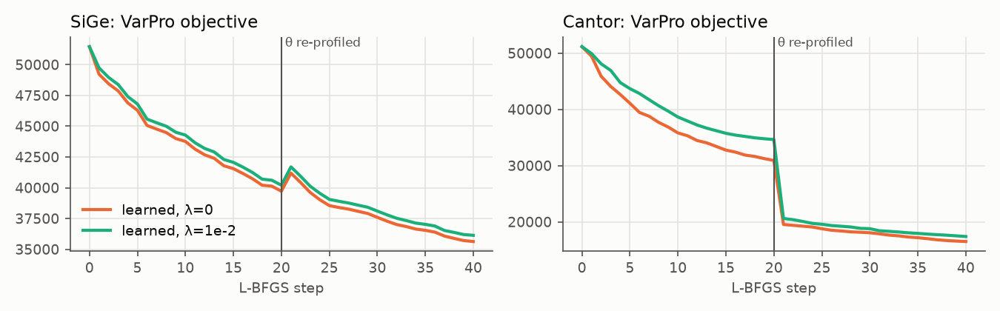
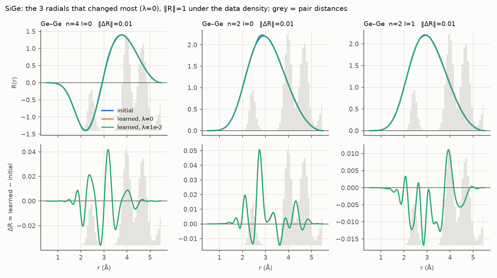
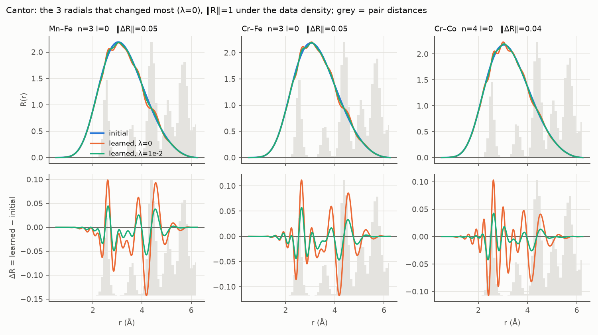
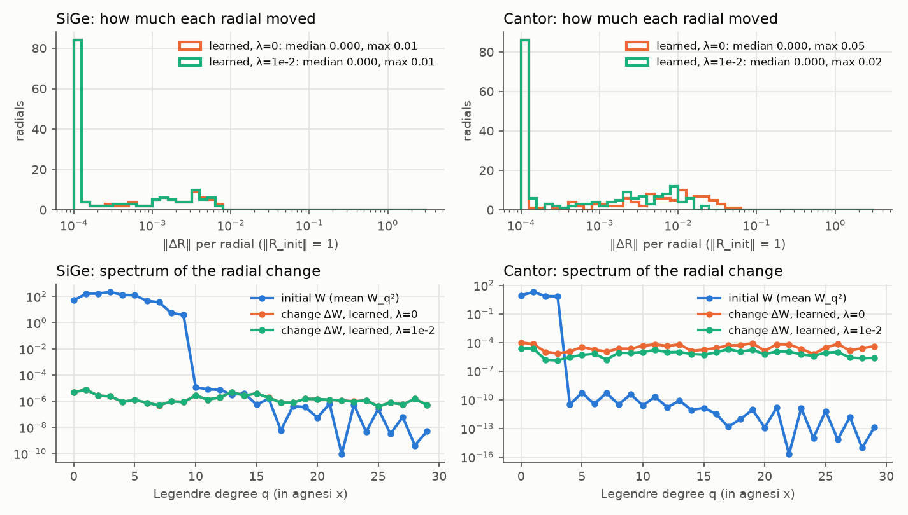

# Learned tensor-radial VarPro: benchmark results (Task 9 Step 6)

Date 2026-09-27. Branch `feat/learn-radial`, code at `b3df415` (post fair-gate
fix: `746d81d` fair held-out gate, `43a39c2` readout written into `model.npz`,
`3724eba` per-λ checkpoints, `b3df415` cheaper bench defaults). Raw driver
output is in
`.superpowers/sdd/2026-09-26-learned-radial-varpro-phase1/benchmark-output.txt`
(per-round logs, gate scores, `summary.json`, and `/usr/bin/time` wall-clock
and max RSS for each system).

## Setup

- Host: moriarty, RTX A4500 GPU, float64 (`jax_enable_x64`).
- `bench/learn_radial/run.py --n-q 30 --steps 40 --reprofile-every 20
  --lam-grid 0,1e-2 --batch 4` (`--map-steps` left at its default, 300).
- Labels: `mace_energy` / `mace_force` / `mace_virial`.
- **SiGe:** `--model ~/acegp-run/sige/sige_base.npz --data
  ~/acegp-run/sige/sige_mh1.xyz --r0 2.35 --ntrain 200 --nval 100`.
- **Cantor (CrMnFeCoNi):** `--model ~/acegp-run/cantor/cantor_d4.npz --data
  ~/ACEpotentials-jax/cantor1k_b_mh1.xyz --r0 2.5 --ntrain 150 --nval 100`.
- **Si:** not run — no production Si dataset is available on moriarty, only
  the 53-config `si_tiny_train.xyz` test fixture, which is far too small to
  stand in for a production benchmark. Si has no row of results below.

### Earlier attempts (recorded for the history)

- The plan's original defaults (`--steps 200`, 4-value `--lam-grid`,
  `--reprofile-every 10`) ran on SiGe for 11.5 h with no progress output and
  were killed without finishing — that run predates the per-round progress
  logging (`3ccd90d`), so there was no way to tell it was making progress at
  all.
- Measured per-pass costs on the shared GPU: a `linear_statistics` streaming
  pass takes about 21 s; one L-BFGS value+grad step (`_lbfgs_step`) about
  69 s.
- A second run, on code before the fair-gate fix (`746d81d`), showed the
  learned radials making progress, but its held-out gate scored candidates
  unfairly (review finding C1: not every candidate went through the same
  θ-MAP-then-score procedure) — that run's selection verdict is discarded;
  only the current, fair-gate run below counts.

## Per-system results

### SiGe

`n_q=30`, `to_analytic relres_max = 2.086e-04`, wall clock (`/usr/bin/time`)
**1:06:18** (3978 s), max RSS **4,959,636 KB ≈ 4.73 GB**. Selected:
**`learned_lam=0.01`**.

| candidate | gate score (own θ-MAP) | score at common a0 | Δ vs init (gate score) | Δ vs init (at a0) |
|---|---|---|---|---|
| init | 14.033771 | 12.037410 | — | — |
| learned_lam=0 | 11.089885 | 10.486020 | −20.98% | −12.89% |
| **learned_lam=0.01 (selected)** | **11.068359** | 10.412930 | **−21.13%** | −13.49% |

Fit-set VarPro+roughness objective (shared reference `r0 = 5.146111e+04` for
both λ, from `learn_radial`'s per-round log; `reason=steps` for every round —
the step budget ran out, not convergence or a line-search stop):

| λ | r0 | round 1 obj (step 20/40) | round 2 obj (step 40/40, final) |
|---|---|---|---|
| 0 | 5.146111e+04 | 3.972087e+04 | 3.563010e+04 |
| 0.01 | 5.146111e+04 | 4.020979e+04 | 3.613348e+04 |

θ-MAP diagnostics at the gate (`map_grad_norm`, `map_dloss_last` over the
last 10 MAP steps): init 2.975e+03 / −6.268e+00; learned_lam=0 2.551e+03 /
−4.230e+00; learned_lam=0.01 2.532e+03 / −4.205e+00.

### Cantor (CrMnFeCoNi)

`n_q=30`, `to_analytic relres_max = 4.872e-07`, wall clock (`/usr/bin/time`)
**17:15.93** (1035.93 s), max RSS **6,479,932 KB ≈ 6.18 GB**. Selected:
**`learned_lam=0`**.

| candidate | gate score (own θ-MAP) | score at common a0 | Δ vs init (gate score) | Δ vs init (at a0) |
|---|---|---|---|---|
| init | 207.830135 | 303.109400 | — | — |
| **learned_lam=0 (selected)** | **108.437846** | 203.940400 | **−47.82%** | −32.72% |
| learned_lam=0.01 | 115.820728 | 245.139400 | −44.27% | −19.13% |

Fit-set VarPro+roughness objective (shared reference `r0 = 5.115108e+04` for
both λ; `reason=steps` for every round here too):

| λ | r0 | round 1 obj (step 20/40) | round 2 obj (step 40/40, final) |
|---|---|---|---|
| 0 | 5.115108e+04 | 3.091329e+04 | 1.650093e+04 |
| 0.01 | 5.115108e+04 | 3.463251e+04 | 1.739522e+04 |

θ-MAP diagnostics: init 1.637e+03 / −2.353e+00; learned_lam=0 8.110e+02 /
−9.892e-01; learned_lam=0.01 1.082e+03 / −1.376e+00.

### Si

Not run — see Setup.

## Production gradient-memory measurement (Task 6 Step 4)

On moriarty, Cantor-scale statistics (`L = 1950`, 38 batches of 4 configs,
`n_q = 30`): `value(all batches) = 1147.0 MB`, `grad(2 batches) = 1333.1 MB`,
`grad(all batches) = 1333.6 MB` — a grad/value ratio of **1.16×**. This
confirms, at production scale, what the CPU fixture-scale test
(`test_gradient_memory_does_not_scale_with_batches`) already showed: gradient
memory does not grow with the number of streamed batches, and it comfortably
clears the spec's <3× bar. No two-pass adjoint is needed.

## Verdict against the spec's success criterion

The spec's criterion: *"learned wins the gate on held-out E+F on at least two
of the three systems (Si, SiGe, CrMnFe)."*

Of the two systems actually run, **both** show `learned` winning the fair
held-out gate over `init`: SiGe by 21.1% (gate score), Cantor by 47.8%. **Si
was not run** (no production dataset available). Stated plainly: 2 of the 2
systems run show a win; the criterion as written needs a verdict on 3
systems, and only 2 were measured. Taking the 2 measured systems at face
value, the feature is worth keeping; a Si production run remains open before
the ≥2-of-3 criterion can be called fully satisfied on the intended system
set rather than on a 2-system subset.

## Figures

## Shape of the learned radials: small, but high-frequency

The radials barely move. Measured in the data-weighted norm, where each
initial radial has norm 1, the median change is below 0.1%. The largest is
about 1% on SiGe and 5% on Cantor at λ = 0. At plot scale the learned curves
lie on top of the initial ones.

The *change*, however, is not smooth:

- **It is spectrally flat up to q = 30.** The initial radials are
  band-limited: Legendre degree ≤ 9 on SiGe and ≤ 3 on Cantor, which reflects
  the spline radials they were projected from. The change ΔW has roughly
  equal power at every degree up to the widened span `--n-q 30`. The share of
  that power at q ≥ 15 is 34% on SiGe and about 50% on Cantor.
- **It sits on the pair-distance peaks.** ΔR(r) consists of wiggles about
  0.3 Å wide, placed on the training pair-distance peaks near 2.5, 4.0 and
  4.5 Å, and it is near zero in the gaps between them.

The optimiser is using the widened polynomial span to add fine structure
tuned to the training distance distribution. The validation split shares
those peaks, so the held-out gate cannot tell physical improvement from this
kind of fit. More steps would let the wiggles grow.

The curvature penalty as implemented barely restrains this:

- **SiGe:** λ = 1e-2 makes no visible difference. The relative scaling
  `λ·r0/rough0` gives λ_abs ≈ 1e-5, because the degree-9 initial radials
  already have a large curvature.
- **Cantor:** λ = 1e-2 halves the wiggles but leaves the spectrum flat.

**Next: a stronger prior.** Three options, cheapest first:

- **(a)** Cap the span at roughly the initial degree plus a few (`--n-q 12`).
- **(b)** Add a spectral prior on the change ΔW, penalising ∝ q^p, as the
  departure-from-init analogue of Γ's degree weighting.
- **(c)** Use a much larger λ grid.

The decisive test is whether most of the held-out gain survives when the
change is forced to be smooth.

## Caveats

- **L-BFGS had not converged at 40 steps.** Every round in both systems ended
  with `reason=steps` (the step budget was exhausted), never `converged` or
  `linesearch`; the objective (see the r0→final tables above) was still
  falling at the end of round 2 in every case. The reported objective and
  gate-score values are therefore snapshots at a fixed compute budget, not
  local optima.
- **θ-MAP is not tightly converged at `map_steps=300`.** The reported
  `map_grad_norm` values are of order 1e3 (ranging 8.1e2–3.0e3 across
  candidates and systems), not near zero. Because every candidate's θ-MAP is
  run with the same `map_steps=300` budget, warm-started from the same `a0`,
  the *comparison* between candidates is fair — but none of the reported
  scores or σ values should be read as converged absolute numbers.
- **The gate score is a σ-normalised sum of squared errors over E and F**
  (`Σ_{t∈{E,F}} SSE_t / (n_t σ_t²)`), not an RMSE and not in physical units.
  Relative improvements (the "Δ vs init" columns above) are ratios of this
  quantity and are meaningful as ratios, but the raw score numbers do not
  convert directly to eV or eV/Å.
- **Virials are not scored** by the held-out gate (`holdout_score`/`gate`
  only sum over `t in "EF"`); a virial-only regression in the learned
  radials, if any, would not be caught by this benchmark.

## Next steps

- **Performance (parked during this task):**
  - λ continuation — each λ in the grid currently starts `learn_radial` fresh
    from `W0` (see `fit_radial`'s loop), rather than warm-starting from the
    previous λ's solution; continuation could cut the grid's total step count.
  - Keeping L-BFGS optimiser state (memory) across θ-reprofiling rounds
    instead of restarting L-BFGS every round — each re-profile currently
    resets the line-search/memory state because the objective changed.
  - A value-first line search, to avoid paying for a gradient on line-search
    trial points that are rejected on value alone.
  - Fusing round start (the post-round `theta_map_linear` re-profile) with
    the next round's first `linear_statistics` pass, if profiling shows the
    separate passes dominate wall time (the per-round logs above show
    `profile_time` at 32–42 s per round, a large fraction of total round
    time on Cantor).
- **Phase 2:** MACE-initialised radials (`scripts/extract_mace_radial.py`,
  `construct/mace_radial.py`), gated as a third/fourth candidate alongside
  `init`/`learned` per the design spec's phase 2 section, and a production Si
  run to close out the ≥2-of-3 criterion on the intended system set.
