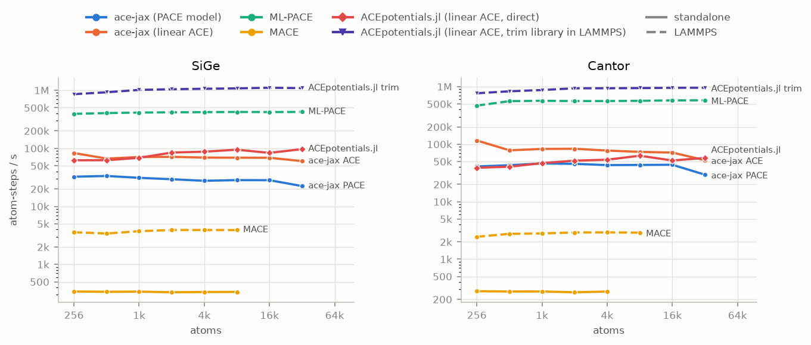
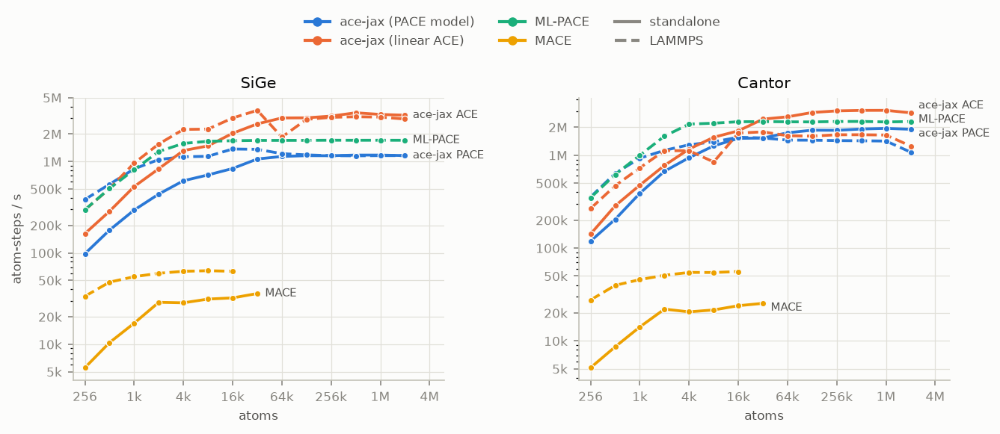
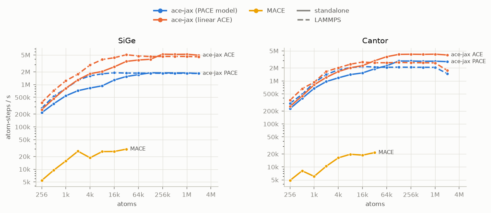

# Performance

How fast ace-jax evaluates energies and forces, next to ML-PACE and MACE, on
one CPU and one GPU. Each figure plots throughput, in **atom-steps per
second** (atoms × evaluations per second, higher is better), against system
size. The workload is MD-like: before each timed energy and forces
evaluation every atom moves slightly, as between consecutive MD steps, and
compilation is not timed. The models are **medium-size models with random
weights**, so they cost what a fitted model costs but predict nothing: PACE
`.yace` models of about 500 basis functions per element (ace-jax and ML-PACE
evaluate the same files), linear ACE models of about 450 per element, and
MACE-MP-0b2 medium. **Standalone** (solid lines) is a direct call of the
evaluator, outside any MD engine (for ace-jax and MACE, one ASE calculator
call from Python, neighbour list included). **LAMMPS** (dashed lines) is the
MD step time inside LAMMPS: ace-jax through lammps-jax ([LAMMPS
export](howto/lammps.md)), ML-PACE as `pair_style pace`, MACE through
Symmetrix. The systems are SiGe, a random alloy on diamond, and Cantor, the
equiatomic CrMnFeCoNi alloy on fcc.

## CPU, float64

ace-jax runs in LAMMPS only on a GPU (lammps-jax is GPU-only), so on the CPU
it appears standalone only.

## GPU, float64

## GPU, float32

## At 8,192 atoms

Atom-steps per second at 8,192 atoms; "—" where a code does not run in that
setting or ran out of memory before that size.

--8<-- "benchmarks-table.md"

## Caveats

--8<-- "benchmarks-notes.md"
- Random weights fix the cost of a model, not its accuracy: these numbers
  compare speed only. A fitted model of the same size runs at the same speed.
- ace-jax standalone reuses its neighbour list while atoms stay within the
  skin; MACE standalone rebuilds it on every call.
- Throughput depends on the model size, the cutoff and the neighbour count;
  the [full benchmarks](https://github.com/ACEsuit/ace-jax/blob/main/docs/dev/benchmarks.md)
  cover small and large models, peak memory and the largest system that fits.

## More

- [Full benchmark results](https://github.com/ACEsuit/ace-jax/blob/main/docs/dev/benchmarks.md):
  every model size and host, memory, precision, parity checks and versions.
- [How to rerun the benchmarks](https://github.com/ACEsuit/ace-jax/blob/main/bench/scaling/README.md).
